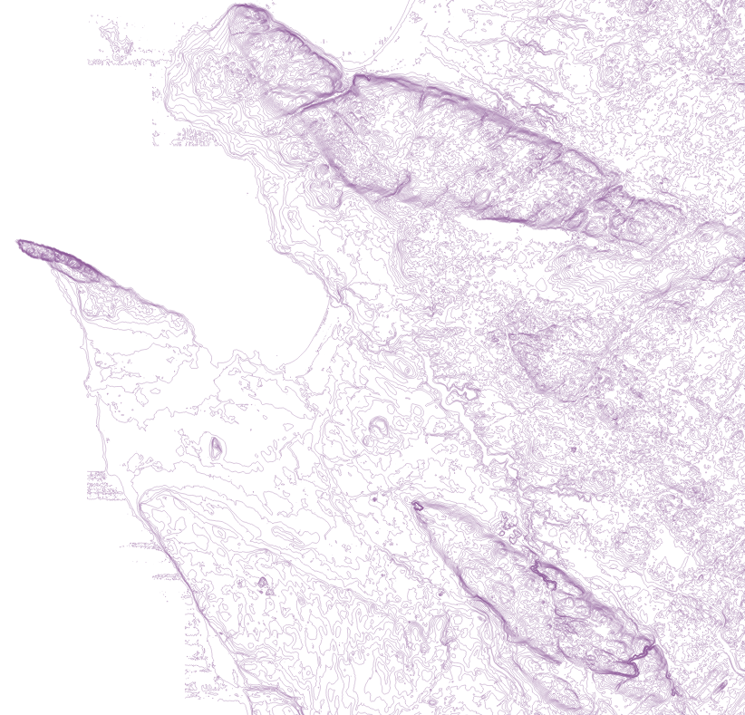 
{width="5.519475065616798in"
height="5.298013998250219in"}

Material för kurser i QGIS 3.4 åt QGIS Sverige 2019.

2019-04-01

# Innehållsförteckning {#innehållsförteckning .TOC-Heading .unnumbered}

[1. Om kompendiet [5](#om-kompendiet)](#om-kompendiet)

[1.1 Bakgrund [5](#bakgrund)](#bakgrund)

[1.2 Syfte [5](#syfte)](#syfte)

[1.3 Innehåll [5](#innehåll)](#innehåll)

[1.4 Om QGIS [5](#om-qgis)](#om-qgis)

[1.5 Öppen geodata i kompendiet
[5](#öppen-geodata-i-kompendiet)](#öppen-geodata-i-kompendiet)

[1.6 Licens för kompendiet
[6](#licens-för-kompendiet)](#licens-för-kompendiet)

[2. Grundläggande om QGIS
[7](#grundläggande-om-qgis)](#grundläggande-om-qgis)

[2.1 Start av QGIS och språkinställningar
[7](#start-av-qgis-och-språkinställningar)](#start-av-qgis-och-språkinställningar)

[2.2 Gränssnittet i QGIS
[7](#gränssnittet-i-qgis)](#gränssnittet-i-qgis)

[2.3 Projekt-filer [8](#projekt-filer)](#projekt-filer)

[3. Övning -- järnvägsbroar på Södra stambanan
[10](#övning-järnvägsbroar-på-södra-stambanan)](#övning-järnvägsbroar-på-södra-stambanan)

[3.1 Inledning [10](#inledning)](#inledning)

[3.2 Lägg till vektorlager
[10](#lägg-till-vektorlager)](#lägg-till-vektorlager)

[3.3 Arbeta i kartvyn [11](#arbeta-i-kartvyn)](#arbeta-i-kartvyn)

[3.4 Lagerhantering [12](#lagerhantering)](#lagerhantering)

[3.5 Attributtabellen [12](#attributtabellen)](#attributtabellen)

[3.6 Symbologi [14](#symbologi)](#symbologi)

[3.7 Spara projekt [16](#spara-projekt)](#spara-projekt)

[3.8 Filtrera lager [16](#filtrera-lager)](#filtrera-lager)

[3.9 Exportera lager [18](#exportera-lager)](#exportera-lager)

[4. Övning -- koordinatsystem och geobearbetning
[19](#övning-koordinatsystem-och-geobearbetning)](#övning-koordinatsystem-och-geobearbetning)

[4.1 Hantering av koordinatsystem
[19](#hantering-av-koordinatsystem)](#hantering-av-koordinatsystem)

[4.2 Projicera om projekt respektive lager
[19](#projicera-om-projekt-respektive-lager)](#projicera-om-projekt-respektive-lager)

[4.3 Redigera data [21](#redigera-data)](#redigera-data)

[5. Ansluta till databas
[23](#ansluta-till-databas)](#ansluta-till-databas)

[5.1 Inledning [23](#inledning-2)](#inledning-2)

[5.2 PostGIS [23](#postgis)](#postgis)

[5.3 SpatiaLite [24](#spatialite)](#spatialite)

[6. Övning -- hantera rasterdata och skapa etiketter
[25](#övning-hantera-rasterdata-och-skapa-etiketter)](#övning-hantera-rasterdata-och-skapa-etiketter)

[6.1 Inledning [25](#inledning-3)](#inledning-3)

[6.2 Lägg till rasterlager
[25](#lägg-till-rasterlager)](#lägg-till-rasterlager)

[6.3 Lagergrupper [25](#lagergrupper)](#lagergrupper)

[6.4 Bandrendering [26](#bandrendering)](#bandrendering)

[6.5 Terrängskuggning [28](#terrängskuggning)](#terrängskuggning)

[6.6 Höjdkurvor [29](#höjdkurvor)](#höjdkurvor)

[6.7 Etiketter [30](#etiketter)](#etiketter)

[6.8 SpatiaLite för export och datakälla
[32](#spatialite-för-export-och-datakälla)](#spatialite-för-export-och-datakälla)

[7. Övning -- WMS tjänster
[34](#övning-wms-tjänster)](#övning-wms-tjänster)

[7.1 Inledning [34](#inledning-4)](#inledning-4)

[7.2 Berggrunder som WMS-tjänst
[34](#berggrunder-som-wms-tjänst)](#berggrunder-som-wms-tjänst)

[7.3 Skyddade naturområden som WMS-tjänst
[37](#skyddade-naturområden-som-wms-tjänst)](#skyddade-naturområden-som-wms-tjänst)

[8. Georeferera bild [39](#georeferera-bild)](#georeferera-bild)

[8.1 Om georeferering [39](#om-georeferering)](#om-georeferering)

[8.2 Georeferering i QGIS
[39](#georeferering-i-qgis)](#georeferering-i-qgis)

[9. Punkter i en yta [41](#punkter-i-en-yta)](#punkter-i-en-yta)

[9.1 Inledning [41](#inledning-5)](#inledning-5)

[9.2 Läs in lager i QGIS
[41](#läs-in-lager-i-qgis)](#läs-in-lager-i-qgis)

[9.3 Räkna punkter i polygon
[41](#räkna-punkter-i-polygon)](#räkna-punkter-i-polygon)

[10. Övning -- csv hantering
[43](#övning-csv-hantering)](#övning-csv-hantering)

[10.1 Inledning [43](#inledning-6)](#inledning-6)

[10.2 Lagerhantering, importera csv-fil
[44](#lagerhantering-importera-csv-fil)](#lagerhantering-importera-csv-fil)

[10.3 Sammanslagning av vektorlager
[44](#sammanslagning-av-vektorlager)](#sammanslagning-av-vektorlager)

[10.4 Skapa virtuellt lager i QGIS
[46](#skapa-virtuellt-lager-i-qgis)](#skapa-virtuellt-lager-i-qgis)

[10.5 Exportera urval [47](#exportera-urval)](#exportera-urval)

[10.6 Ny sammanslagning [48](#ny-sammanslagning)](#ny-sammanslagning)

[10.7 Redigera lager [48](#redigera-lager)](#redigera-lager)

[10.8 Geobehandlingsverktyg: Lös upp
[49](#geobehandlingsverktyg-lös-upp)](#geobehandlingsverktyg-lös-upp)

[10.9 Geobehandlingsverktyg: Buffert
[50](#geobehandlingsverktyg-buffert)](#geobehandlingsverktyg-buffert)

[10.10 Geobehandlingsverktyg: Differens
[51](#geobehandlingsverktyg-differens)](#geobehandlingsverktyg-differens)

[10.11 Geobehandlingsverktyg: Klipp
[52](#geobehandlingsverktyg-klipp)](#geobehandlingsverktyg-klipp)

[10.12 Symbologi [53](#symbologi-1)](#symbologi-1)

[10.13 Etiketter [55](#etiketter-1)](#etiketter-1)

[11. Övning -- utskriftslayout
[57](#övning-utskriftslayout)](#övning-utskriftslayout)

[11.1 Inledning [57](#inledning-7)](#inledning-7)

[11.2 Allmänt om layout och mallar
[57](#allmänt-om-layout-och-mallar)](#allmänt-om-layout-och-mallar)

[11.3 Ny utskriftslayout [57](#ny-utskriftslayout)](#ny-utskriftslayout)

[11.4 Gränssnittet i layoutfönstret
[57](#gränssnittet-i-layoutfönstret)](#gränssnittet-i-layoutfönstret)

[11.5 Lägg till karta [57](#lägg-till-karta)](#lägg-till-karta)

[11.6 Teckenförklaring [59](#teckenförklaring)](#teckenförklaring)

[11.7 Lägg till rubrik [59](#lägg-till-rubrik)](#lägg-till-rubrik)

[11.8 Norr-pil och skalstock
[59](#norr-pil-och-skalstock)](#norr-pil-och-skalstock)

[11.9 Attributtabell [59](#attributtabell)](#attributtabell)

[11.10 Exportera kartan [60](#exportera-kartan)](#exportera-kartan)

[12 Insticksprogram [61](#insticksprogram)](#insticksprogram)

[Appendix A Hämta data ifrån Lastkajen (Trafikverket)
[62](#appendix-a-hämta-data-ifrån-lastkajen-trafikverket)](#appendix-a-hämta-data-ifrån-lastkajen-trafikverket)

[Appendix B Formatet GeoPackage
[63](#appendix-b-formatet-geopackage)](#appendix-b-formatet-geopackage)

[Appendix C Om QGIS Sverige
[64](#appendix-c-om-qgis-sverige)](#appendix-c-om-qgis-sverige)

## Om kompendiet

### 1.1 Bakgrund {#bakgrund .unnumbered}

Föreningen QGIS Sverige slöt hösten 2018 avtal med Sweco Position AB för
arbete med att ta fram kursmaterial för grundkurs i QGIS 3 samt att
hålla minst två kurser baserat på detta material under våren 2019. Detta
kurskompendium tillsammans med den öppna data som används i det, utgör
kursmaterialet.

### 1.2 Syfte {#syfte .unnumbered}

Kompendiet ska ligga till grund för hållande av grundkurs i QGIS 3.
Vidare ska kompendiet kunna användas fristående, d.v.s. det är skrivet
på ett sätt som gör att teori och övningsmoment går att tillgodogöra sig
utan att gå kurs.

### 1.3 Innehåll {#innehåll .unnumbered}

Kompendiet ger en introduktion till programmet QGIS. Målet är att
deltagarna ska ha följande kunskaper i QGIS Desktop 3.4 efter kursen:

-   övergripande kunskap om gränssnittet

-   kunna hantera koordinatsystem

-   kunna lägga till minst följande datatyper i ett QGIS-projekt:

```{=html}
<!-- -->
```
-   vektor

-   raster

-   ur databas

-   WMS

```{=html}
<!-- -->
```
-   administrera insticksprogram

-   redigera data, både geometri och i attributtabell

-   övergripande kunskap om kapaciteten i QGIS gällande vektoranalys

-   tematisera lager utifrån attributdata

-   förstå hur stil-sättning och etikettering fungerar

-   förstå hur layout, kartproduktion och utskriftsfunktionen fungerar

### 1.4 Om QGIS {#om-qgis .unnumbered}

QGIS är ett fritt tillgängligt GIS-program skriven i öppen källkod.
Programmet har en aktiv utvecklar- och användargrupp och används brett
av såväl offentliga som privata aktörer. Kurskompendiet är skrivet
utifrån QGIS version 3.4. Detta är den senaste, per april 2019, s.k. LTR
(*Long Term Release*). Med LTR avses en version som har blivit grundligt
testad och är stabil. Andra versioner kan ha fler funktioner, men är
inte lika stabila. För produktionsmiljöer och utbildningssyften är det
oftast LTR-versioner som används.

Kompendiet är skrivet utifrån den svenska översättningen av gränssnittet
i QGIS. I vissa fall är översättningen inte helt perfekt och vissa
texter i gränssnittet är på engelska. Hänvisningar i texten görs till
hur det står i gränssnittet med den svenska översättningen aktiv, d.v.s.
en engelsk text kommer att refereras till med den engelska texten.

### 1.5 Öppen geodata i kompendiet {#öppen-geodata-i-kompendiet .unnumbered}

I kompendiet används öppen geodata från Trafikverket, Lantmäteriet,
Statistiska Centralbyrån (SCB), Naturvårdsverket, Sveriges geologiska
undersökning (SGU) samt OpenStreetMap. För att hämta öppen geodata från
Lantmäteriet respektive Trafikverket, krävs registrering med
e-postadress. Appendix A beskriver registrering och nedladdning från
Trafikverkets plats för att hämta geodata, Lastkajen.

Den öppna geodata som används i kompendiet, tillsammans med licensformen
inom parantes, listas nedan. Därefter följer en redogörelse för vad de
olika licenserna innebär (källa:
<http://www.creativecommons.se/om-cc/licenserna/>).

+----------------------------------------+----------+------------------+
| **Datamängd**                          | *        | **Tillgängligt   |
|                                        | *Källa** | via**            |
+========================================+==========+==================+
| Järnvägsnät_grundegenskaper.zip        | Traf     | Lastkajen        |
|                                        | ikverket |                  |
|                                        | (CC0).   |                  |
+----------------------------------------+----------+------------------+
| *nh_                                   | Lant     | <https://www.l   |
| 12_Skane_lan_Sweref_99_TM_geotiff.zip\ | mäteriet | antmateriet.se/s |
| *                                      | (CCBY).  | v/Kartor-och-geo |
|                                        |          | grafisk-informat |
| Skåne län ur produkten                 |          | ion/oppna-data/> |
| GSD-Hojddata_grid_50_plus              |          |                  |
+----------------------------------------+----------+------------------+
| SCB tätortsytor: *To2015_Swe99TM.shp*  | SCB      | <h               |
|                                        | (CC0)    | ttps://www.scb.s |
|                                        |          | e/hitta-statisti |
|                                        |          | k/regional-stati |
|                                        |          | stik-och-kartor/ |
|                                        |          | geodata/oppna-ge |
|                                        |          | odata/tatorter/> |
+----------------------------------------+----------+------------------+
| Kom                                    | SCB      | <https://w       |
| munytor:*Kommun_Sweref99TM_region.shp* | (CC0)    | ww.scb.se/hitta- |
|                                        |          | statistik/region |
|                                        |          | al-statistik-och |
|                                        |          | -kartor/regional |
|                                        |          | a-indelningar/di |
|                                        |          | gitala-granser/> |
+----------------------------------------+----------+------------------+
| *Urval ur SCB:s statistikdatabas*\     | SCB      | <http:           |
| <http://www.statistikdatabasen.scb.se> | (CC0)    | //www.statistikd |
| Välj                                   |          | atabasen.scb.se> |
| Befolkning-\>Befolkni                  |          |                  |
| ngsstatistik-\>Folkmängd-\>Folkmängden |          |                  |
| efter region, civilstånd, ålder och    |          |                  |
| kön. År 1968 -- 2018.\                 |          |                  |
| Variablerna tabellinnehåll=Folkmängd,  |          |                  |
| region=startar med 05, civilstånd=alla |          |                  |
| värden, ålder=totalt ålder, kön=alla   |          |                  |
| värden, År=2018,2008 och 1968.         |          |                  |
+----------------------------------------+----------+------------------+
| *denmark-latest-free.shp.zip*          | OpenSt   | OpenStre         |
|                                        | reetMap( | etMap/Geofabrik, |
|                                        | CCBY-SA) | <http://dow      |
|                                        |          | nload.geofabrik. |
|                                        |          | de/europe.html>. |
+----------------------------------------+----------+------------------+
| http://gis-services.metri              | Naturvår | WMS.             |
| a.se/ArcGIS/services/InspireNV_NVR/Map | dsverket |                  |
| Server/InspireViewService?layers=PS.NR | (CC0)    |                  |
+----------------------------------------+----------+------------------+
| [*https://resource.sgu.se/service/     | SGU      | WMS.             |
| wms/130/berggrund_1M*](https://resourc | (CCBY)   |                  |
| e.sgu.se/service/wms/130/berggrund_1M) |          |                  |
+----------------------------------------+----------+------------------+

CC0: upphovsmannen har gjort ett verk tillgängligt för allmänheten genom
att man har frigjort verket från alla upphovsrättsliga begränsningar
runt om i världen.

CCBY: upphovsmannen tillåter andra att använda, sprida, göra om,
modifiera och bygga vidare på verk, även i kommersiella sammanhang. De
som använder verken ska uppge upphovsmannen.

CCBY-SA: upphovsmannen tillåter andra att använda, sprida, göra om,
modifiera och bygga vidare på verk. De som använder verken ska uppge
upphovsmannen. Alla nya verk som skapas utifrån ett verk som har den här
licensen ska ha samma licens, som ursprungsverket.

### 1.6 Licens för kompendiet {#licens-för-kompendiet .unnumbered}

Kompendiet är framtaget av Sweco Position och är tillgänglig under
licensen CCBY. Se avsnitt 1.5 ovan för beskrivning av licensen.

## Grundläggande om QGIS

### 2.1 Start av QGIS och språkinställningar {#start-av-qgis-och-språkinställningar .unnumbered}

Vid start av QGIS visas en startsida, varifrån det går fort att komma åt
sitt senaste arbete (jfr. Figur 2.1 nedan). Ifall texterna i
gränssnittet är på engelska och du hellre vill ha det inställt på
svenska, ändras detta genom att i menyraden högst upp välja *Settings*
*Options*. Välj därefter fliken *General* och ändra *User Interface
Translation* till svenska samt *Locale* till Swedish Sweden (sv_SE).
Tryck på knappen *OK*, stäng QGIS och starta programmet igen för att
ändringarna ska slå igenom.

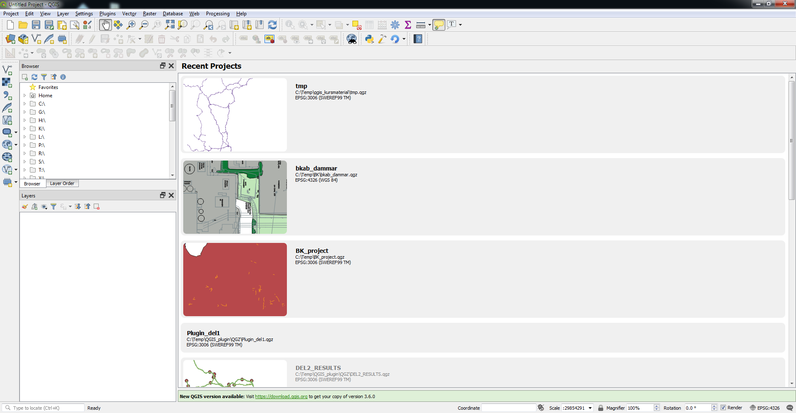{width="6.3in" height="3.275in"}

*Figur 2.1* *QGIS startsida.*

Starta därefter ett nytt, blankt projekt genom att trycka på knappen
*Nytt projekt*
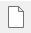{width="0.2553499562554681in"
height="0.2718241469816273in"} uppe till vänster.

### 2.2 Gränssnittet i QGIS {#gränssnittet-i-qgis .unnumbered}

Gränssnittet i QGIS är likt andra GIS-program i sin uppbyggnad. Överst
finns en menyrad och därunder verktygsfält. Till vänster finns paneler
för datakällor och lager. Den större delen till höger är själva kartvyn.
Längs vänstra sidan finns knappar för att hantera lager. Längst ned
finns ett statusfält för information om koordinater, skala, projektion
m.m. Huvuddelarna i gränssnittet är sammanfattningsvis (jfr Figur 2.2
nedan):

1.  Menyrad

2.  Verktygsfält

3.  Datakällor

4.  Lager

5.  Hantera lager

6.  Statusfält

7.  Kartvy

8.  Geobearbetning verktygslåda

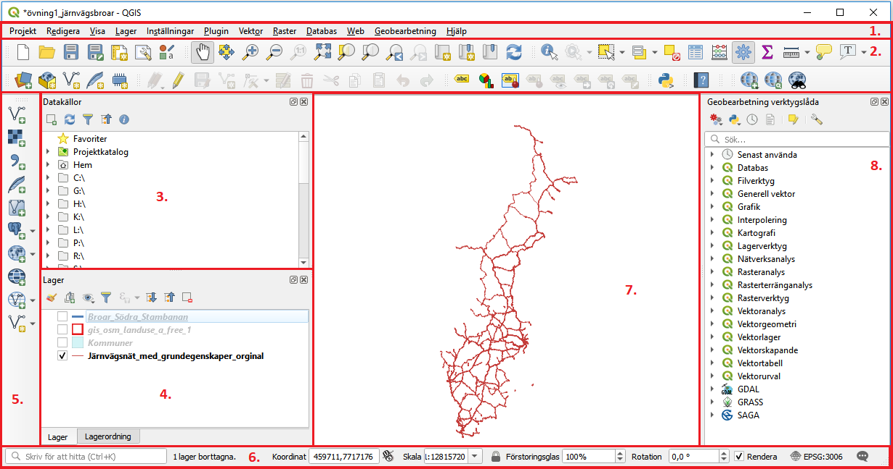{width="6.3in" height="3.31875in"}

*Figur 2.2 Gränssnittet i QGIS.*

I **kartvyn** (nummer 7 ovan) visas den geodata som för tillfället är
inläst och aktiv. Denna är strukturerad (automatiskt eller av
användaren) i lager och lagergrupper, vilka syns i panelen **Lager**
(4). Lagren innehåller geodata tillsammans med dess attribut och i
lagerpanelen kan vi se och ändra strukturen på dessa. I **menyraden**
(1) finns flertalet val, från att spara ett projekt till att ladda ned
s.k. insticksprogram.

**Verktygsfältet** (2) består av olika funktioner för att på något vis
interagera med programmet, t.ex. kartvyn. Verktygen är grupperade och
via menyraden går det att ta bort eller lägga till olika
verktygsgrupper. För du muspekaren över en verktygsikon, dyker en
förklarande text upp. I Figur 2.2 ovan är panelen **Hantera lager** (5)
tillagd genom att i menyraden välja *Visa Verktygsfält* och bocka i
alternativet *Hantera lager (traditionell).*

I **statusfältet** (6) längs ned visas aktuella koordinater för
muspekarens läge i kartvyn, tillsammans med aktuell skala. Det går att
ändra ifrån visning av koordinater till att istället visa koordinater
för aktuell utbredning av kartvyn. Även skala går att ställa in här (i
övrigt ändras skalan vid varje in- eller utzoomning i kartvyn). Nere
till höger visas information om vilket koordinatsystem som geodatan i
kartvyn ligger i.

I **Geobearbetning verktygslåda** (8) finns ett antal verktyg som kan
användas till beräkningar och bearbetning av lager och data. Den visas
genom att markera *Verktygslåda* under *Geobearbetning* i menyraden.

### 2.3 Projekt-filer {#projekt-filer .unnumbered}

I QGIS är det viktigt att hålla isär begreppen data och projekt.
**Data** är de olika filer vi öppnar i programmet eller skapar själva
inne i programmet. När vi ändrar ett namn i lagerlistan eller ändrar
genomskinligheten på ett lager, ändrar vi *representationen av data*.
Sådan information hålls i QGIS samman i **projekt**, vilka lagras som
projekt-filer. Det går därmed att ha samma data med olika
representationer av data, t.ex. helt olika färgsättning, lagrade i olika
projekt-filer.

Från version 3.2 av QGIS och framåt är filändelsen/formatet **qgz**
standard för en sparad projekt-fil (tidigare **qgs**). I sin enklaste
form är en projekt-fil en komprimerad textfil som innehåller länkar till
geodata samt information om hur QGIS ska representera denna geodata. En
del arbete lagras även som andra filer (exempelvis svg-logotyp), men
alltihopa resulterar i en komprimerad qgz projekt-fil. Jämfört med
tidigare struktur med en qgs-fil samt flertalet andra filer i
förekommande fall, innebär övergången till qgz två centrala fördelar.
Dels gör komprimeringen filstorleken avsevärt mindre och dels är det
bara en projekt-fil att hålla reda på. Det krävs ingen separat
uppackning för att öppna en qgz fil i QGIS utan det fungerar sömlöst.

Som nämnts ovan sparas länkar till data i projekt-filen. Data kan finnas
lokalt på användarens dator, på en delad resurs eller åtkomlig via
internet. Ändras platsen var data ligger, t.ex. ifall filerna flyttas på
filsystemet, kommer länkarna att bli brutna. Liknande inträffar även
ifall du delar en projekt-fil där mottagaren inte har åtkomst till
lagringsplatsen för data. Försöker vi öppna ett projekt med brutna
länkar, får vi en varningsruta där det framgår vilka lager som har
brutna länkar och där vi kan uppdatera dessa så att de pekar rätt.

Figur 2.3 nedan visar dialogrutan för att hantera förlorade lager. I
detta fallet sparades ett projekt med rätt sökväg till data. Därefter
döptes en av undermapparna om i *Utforskaren*. När vi åter öppnar
projektet behöver vi hantera den brutna länken.

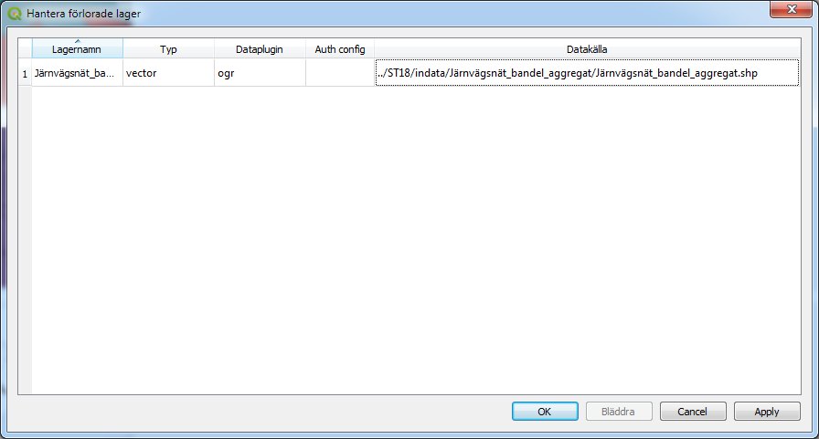{width="4.979930008748906in"
height="2.6733103674540684in"}

*Figur 2.3* *Hantera förlorade lager.*

## Övning -- järnvägsbroar på Södra stambanan

### 3.1 Inledning {#inledning .unnumbered}

I övningen använder vi geodata ifrån Trafikverket, där vi vill söka ut
järnvägsbroar som ligger på Södra Stambanan. Vi arbetar här med
datasetet uppackat, även om det går utmärkt att läsa in en komprimerad
fil i QGIS. Vidare använder vi geodata över tätortsytor i Sverige ifrån
SCB.

Indata:

-   *Järnvägsnät_grundegenskaper.zip* (uppackad på filsystemet)

-   *To2015_Swe99TM.shp*

Starta QGIS och välj Nytt projekt, ifall du inte redan har programmet
öppet med ett blankt projekt.

### 3.2 Lägg till vektorlager {#lägg-till-vektorlager .unnumbered}

Det finns ett flertal sätt att lägga till ett lager i ett projekt. Nedan
följer några sätt som är bra att känna till. Metoderna är snarlika för
andra typer av lager, men för tillfället koncentrerar vi oss på
vektorlager.

-   Tryck på knappen
    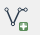{width="0.26637685914260717in"
    height="0.23308070866141734in"} *Lägg till vektorlager* i
    verktygsfältet *Hantera lager* till vänster i gränssnittet,

-   via menyraden *Lager Lägg till lager Lägg till vektorlager*,

-   leta upp filen i Utforskaren i Windows samt dra och släpp den till
    kartvyn i QGIS, eller

-   leta upp filen i fönstret för datakällor i QGIS samt dra och släpp
    den i kartvyn.

Med de två första metoderna ovan öppnas en dialogruta likt Figur 3.1
nedan. Tryck på knappen
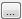{width="0.19143044619422572in"
height="0.16532589676290463in"} för att bläddra till filen
*Järnvägsnät_med_grundegenskaper.shp*, tryck *OK* samt därefter *Lägg
till* och *Close*. Lagret läggs till i lagerlistan och järnvägsnätet
syns i kartvyn.

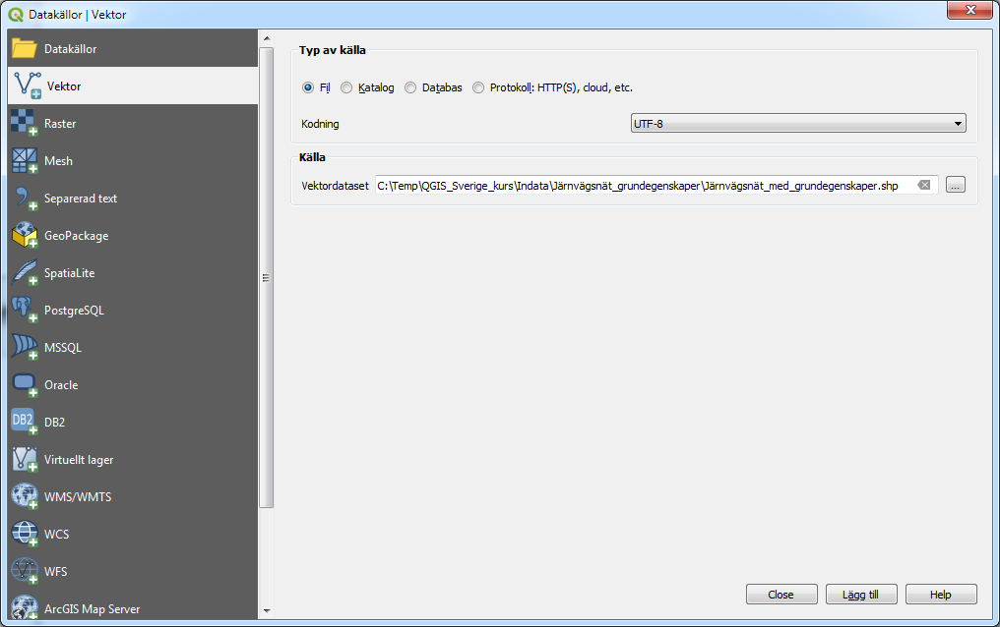{width="4.984143700787402in"
height="3.129923447069116in"}

*Figur 3.1 Dialogrutan Datakällor \| Vektor.*

Lägg även till lagret med tätorter ifrån SCB (filen
*To2015_Swe99TM.shp*), med någon utav metoderna ovan. Alla tätorter i
Sverige blir tillagda i kartvyn och det ska nu se ut likt Figur 3.2
nedan. Observera att lagren per automatik får slumpmässiga färger, då de
läggs till ett projekt.

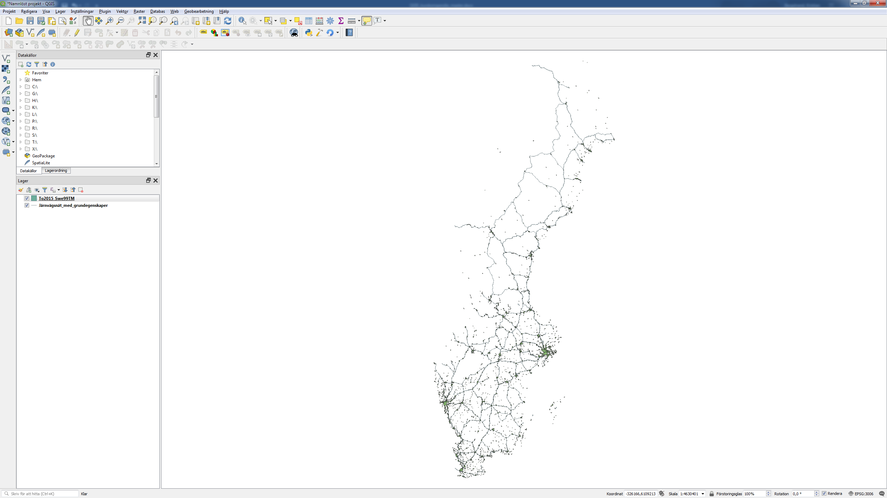{width="5.640238407699037in"
height="3.1726345144356953in"}

*Figur 3.2 Lagren järnvägar och tätorter tillagda i projektet.*

### 3.3 Arbeta i kartvyn {#arbeta-i-kartvyn .unnumbered}

Då musmarkören ställs i kartvyn märker du att den symboliseras med en
hand som standard, vilket innebär att panoreringsverktyget är aktivt.
Klicka och dra i kartvyn för att panorera kartan, eller klicka och håll
nere scroll-hjulet på musen och flytta därefter musen. I verktygsgruppen
*Kartnavigering* i verktygsfältet finns olika val för att interagera med
kartvyn.

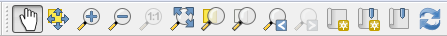{width="4.1948567366579175in"
height="0.33784120734908135in"}

*Figur 3.3 Verktygsgruppen Kartnavigering.*

Förstoringsglasen med plus- och minussymboler används för att zooma in
respektive ut i kartvyn. När något av dessa två verktyg är aktivt, går
det även att klicka och dra en rektangel för att zooma in/ut centrerat
över ett visst område. Ett smidigt alternativ är att snurra
scroll-hjulet på musen för att zooma åt respektive håll. Knappen *Zooma
Allt* 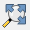{width="0.23702865266841644in"
height="0.23702865266841644in"} ställer kartvyn i ett zoomläge som
fångar in utsträckningen av alla aktiva lager.

Vidare finns det i verktygsgruppen bl.a. ikoner för att arbeta med s.k.
bokmärken. Dessa fungerar som snabbåtkomst till visst zoom- och
panoreringsläge. Lägg till ett bokmärke genom att zooma in över valfri
tätort och tryck på knappen *Nytt bokmärke*
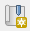{width="0.22083333333333333in"
height="0.22847222222222222in"}. Panelen *Rumsliga bokmärken* dyker upp,
där du namnger ditt bokmärke. Använd sedan knappen *Zooma Allt* och
dubbelklicka därefter på ditt nyss sparade bokmärke. Kartvyn ställer då
in sig exakt som då du skapade bokmärket. I vissa fall är det väldigt
användbart att använda sig av bokmärken för att snabbt komma åt olika
visningslägen.

Säkert har du vid det här laget lagt märke till att tätortsytorna helt
eller delvis täcker järnvägslinjerna i kartvyn. Det som styr i vilken
ordning lagren visas i kartvyn är lagerlistan, vilken behandlas i
följande avsnitt. Som en tumregel är det bra att ha punktlager överst,
därefter lager med linjer och slutligen polygonlager.

### 3.4 Lagerhantering {#lagerhantering .unnumbered}

Hantering av lager görs i panelen Lager till vänster. Här kan vi byta
namn på lager, visa/dölja ("tända"/"släcka") lager i kartvyn, ändra
ordningen för hur lagren syns i kartvyn, komma åt lagrens egenskaper
etc.

Börja med att byta namn på lagret *To2015_Swe99TM* genom att markera det
och tryck F2 eller högerklicka på det *Byt namn på lager*. Namnge det
*Tätorter_utbredning*. Passa även på att visa hur många objekt som
lagret innehåller genom att högerklicka på lagret *Visa antal objekt*.
Det är ofta väldigt användbart att ha visningen av antalet objekt
påslaget. Byt även namn på lagret *Järnvägsnät_med_grundegenskaper* till
att bara heta *Järnvägsnät*.

Lagerordningen ändras genom att dra och släppa lagren till önskad
hierarki. Det lager som är överst i panelen är även det lager som
renderas överst i kartvyn. Klicka på lagret *Tätorter_utbredning.* Dra
och släpp det under järnvägslagret i lagerlistan. Kommunytorna ligger nu
under järnvägarna. Zooma till någon tätort och kontrollera detta.

Det är inte alltid önskvärt att visa alla inlästa lager i kartvyn. För
att dölja ett lager, bocka ur rutan till vänster om lagret. Lagret döljs
i kartvyn och lagernamnet kursiveras i lagerlistan, jfr Figur 3.4 nedan.

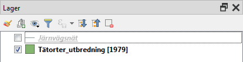{width="4.3125in"
height="1.1041666666666667in"}

*Figur 3.4 Rutor för att visa/dölja lager.*

### 3.5 Attributtabellen {#attributtabellen .unnumbered}

För att se attributtabellen som är kopplad till ett lager, högerklicka
på lagernamnet *Öppna attributtabell*. Gör detta för lagret
*Järnvägsnät* i lagerlistan och attributtabellen kommer att öppnas i ett
separat fönster. Direkt ser vi att de svenska tecknen inte läses in
korrekt (jfr Figur 3.5 nedan). Detta kunde vi antingen ha åtgärdat
direkt då vi la till lagret (jfr. Figur 3.1 ovan), genom att ändra
*Kodning*, eller nu i efterhand. Stäng attributtabellen, högerklicka på
lagernamnet och välj *Egenskaper*. I fliken *Källa* under
*Inställningar*, välj t.ex. windows-1252 eller latin9 för *Datakällans
kodning*.

Tryck OK och öppna attributtabellen på nytt, de svenska tecknen ska då
skrivas ut som förväntat. Bekanta dig en stund med attributen, framöver
kommer vi främst att vara intresserade av attributen *Straknamn* och
*Bro*. Stäng därefter attributtabellen.

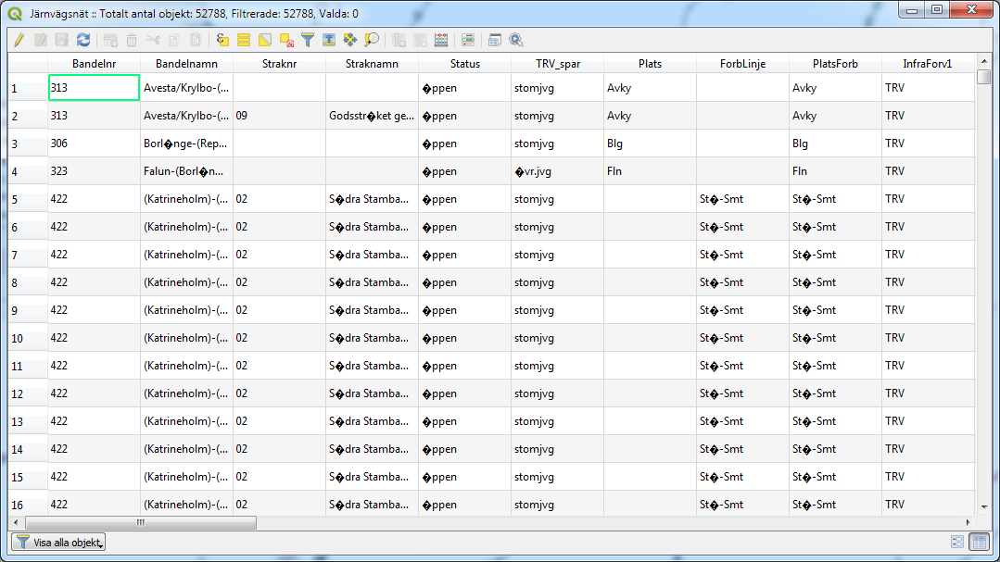{width="5.889699256342957in"
height="3.3136056430446192in"}

*Figur 3.5 Attributtabellen för lagret Järnvägsnät.*

Sannolikt upplever du samma problem med de svenska tecknen för lagret
med tätorter. Åtgärda detta på motsvarande sätt som ovan och öppna
därefter tätortslagrets attributtabell.

Markera en rad i attributtabellen genom att klicka på ett radnummer
längst till vänster. Objektet får en selekteringsfärg i kartvyn, vilket
du kan se lättare om du högerklickar på den markerade raden och väljer
*Zooma till objekt.* Markera därefter ytterligare några rader i
attributtabellen genom att hålla nere ctrl-knappen och klicka på ett
antal rader. Därefter kan vi panorera eller zooma till valda rader via
knapparna {width="0.3680555555555556in"
height="0.1840277777777778in"} i attributtabellens verktygsfält. Ett
exempel visas nedan i Figur 3.6.

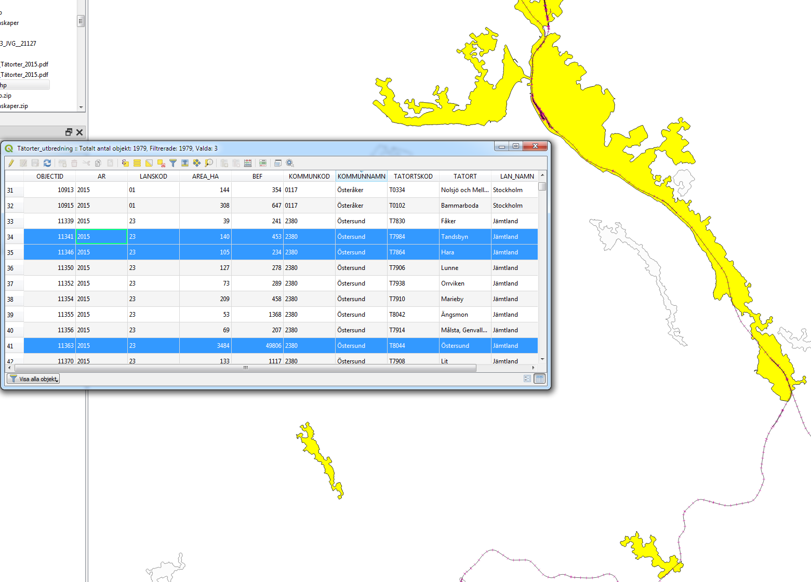{width="4.034900481189851in"
height="2.8976377952755907in"}

*Figur 3.6 Selektering av objekt via attributtabellen.*

Avmarkera därefter raderna genom att trycka på knappen *Avmarkera alla*
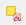{width="0.17614063867016622in"
height="0.16936570428696412in"}. Testa nu, utan att stänga
attributtabellen, att istället markera ett objekt i kartvyn genom
knappen *Välj objekt...*
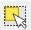{width="0.18563101487314085in"
height="0.17964238845144356in"} i verktygsfältet i huvudfönstret. Växla
över till attributtabellen och notera att det valda objektet nu även är
selekterat i attributtabellen. Tryck återigen på *Avmarkera alla* och
stäng därefter attributtabellen.

### 3.6 Symbologi {#symbologi .unnumbered}

Det finns en uppsjö av alternativ för att symbolisera lager. Vilka
alternativ som är tillgängliga styrs av geometritypen på lagret (punkt,
linje eller polygon).

Byt färg på lagret *Tätorter_utbredning* genom att högerklicka på lagret
*Egenskaper Symbologi*. Ändra t.ex. färg till blå och ställ in
opaciteten på lagret till 25%. Opaciteten styr hur genomskinligt lagret
är; 100% innebär helt ogenomskinligt och vice versa. Testa olika
inställningar genom att trycka på *Apply* och när du är nöjd klicka på
*OK*.

Öppna inställningarna för lagret *Järnvägsnät* på liknande sätt som
ovan. Notera att valen är olika beroende på att det är olika
geometrityper. Använd en av symbolerna som finns i QGIS symbolbibliotek,
*topo railway*, jfr Figur 3.7 nedan. Ändra *Bredd* till 1. Tryck *Apply*
för att se denna symbolisering i kartvyn. Tryck på knappen *OK* när du
är nöjd med symbologin.

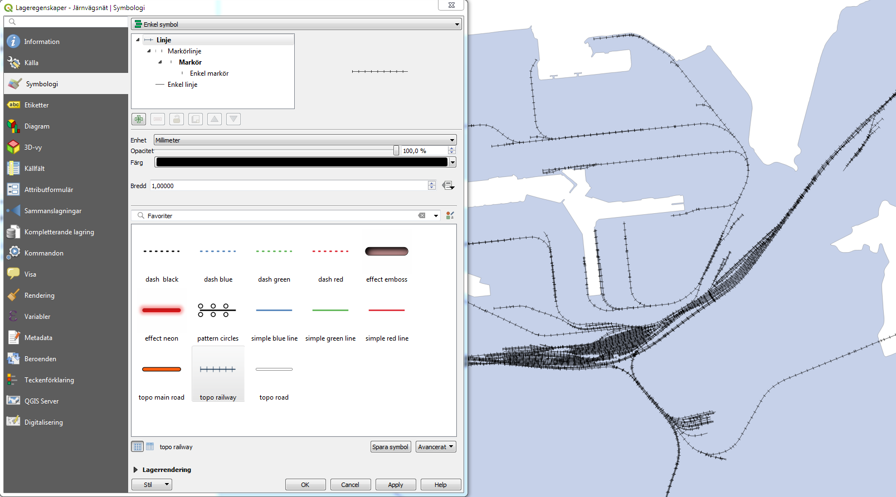{width="5.9911056430446195in"
height="3.3270713035870516in"}

*Figur 3.7 Användning av QGIS symbolbibliotek för att symbolisera lagret
med järnvägar.*

De bägge symbolsättningarna ovan var av typen *Enkel symbol (jfr överst
i Figur 3.7)*, vilket innebär att alla objekt i lagret kommer att
symboliseras på samma sätt. Bland övriga val för denna inställning finns
bl.a. *Kategoriserad* och *Intervall*. Med kategoriserad symbolsättning
kan vi t.ex. ha olika symboler för järnvägarna beroende på vilken region
de tillhör. Varje unikt värde på attributet *Regionnamn* i detta lager
(*Region Norr, Region Mitt* osv.) blir automatiskt en kategori och vi
kan symbolisera varje kategori individuellt. Väljer vi t.ex. *Intervall*
för symbolisering av tätorterna kan vi dela in dessa i grupper utefter
attributet med befolkningsantal för tätorten (*BEF)*. Varje grupp kan
sedan symboliseras individuellt på motsvarande sätt som den
kategoriserade symbolsättningen.

Gör en kategoriserad symbolsättning av lagret *Järnvägar,* genom att i
lageregenskaperna välja *Kategoriserad* i fliken *Symbologi.* I samma
flik, sätt inställningen *Kolumn* till *Regionnamn* och tryck på knappen
*Klassificera* (jfr Figur 3.8 nedan). Tryck därefter *Apply* för att se
resultatet i kartvyn och tryck *OK* när du är nöjd.

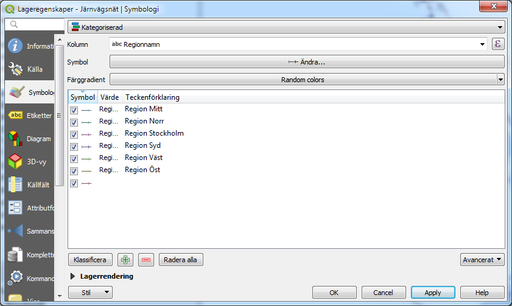{width="5.515487751531059in"
height="3.2988353018372703in"}

*Figur 3.8 Kategoriserad symbolsättning.*

Gör nu en symbolsättning med intervall för lagret *Tätorter_utbredning.*
Gå till dess lageregenskaper, fliken *Symbologi* och välj *Intervall*
högst upp. Välj *BEF* för inställningen *Kolumn* och *Grey* för
inställningen *Färggradient.* Prova därefter att sätta *Läge* till
*Naturliga brytpunkter (Jenks)* och tryck *Klassificera* samt *Apply*
för att se resultatet i kartvyn. Se även lagerlistan för att se hur
många tätorter som faller inom respektive intervall (jfr Figur 3.9
nedan). Ändra *Läge* och/eller *Klasser* tills du är nöjd med resultatet
och tryck därefter *OK.*

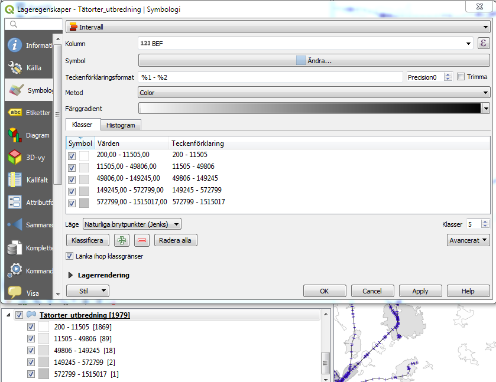{width="4.847201443569554in"
height="3.7379877515310587in"}

*Figur 3.9 Symbolsättning med intervall.*

Figur 3.10 nedan visar ett exempel på symbolsättning av tätorter med
intervall samt symbolsättning med kategorier för järnvägarna. Tätorter
med större befolkningsmängd ges här en mörkare färg och järnvägarna ges
olika färg beroende på vilken region de tillhör.

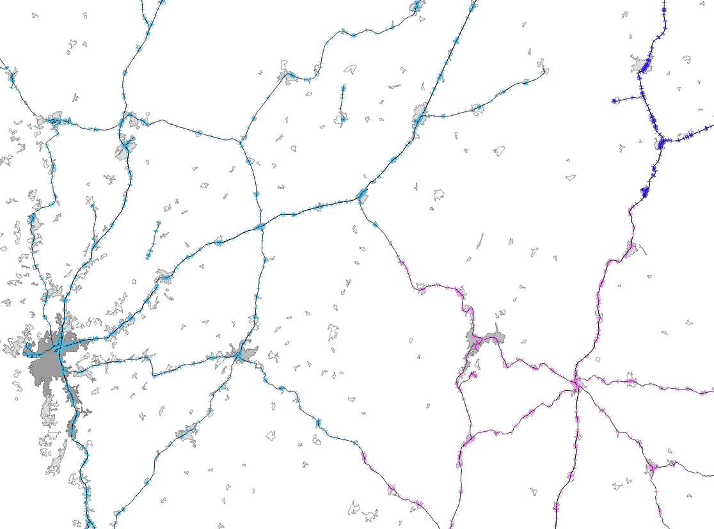{width="4.13184820647419in"
height="3.0619947506561678in"}

*Figur 3.10 Symbolisering med intervall för tätorter samt kategorier för
järnvägar.*

### 3.7 Spara projekt {#spara-projekt .unnumbered}

När vi nu kommit en bit i vårt arbete är det en god idé att spara
projektet. Gå till menyraden *Projekt Spara som*. Ange namnet *Övning_1*
och spara på lämpligt ställe. Spara dina olika projekt med jämna
mellanrum framöver, antingen via ctrl+s eller *Projekt Spara.*

### 3.8 Filtrera lager {#filtrera-lager .unnumbered}

För att enbart visa järnvägslinjer som tillhör Södra stambanan, behöver
vi filtrera lagret med järnvägar. Högerklicka på lagret *Filter*. Ett
fönster, *Frågebyggare*, öppnas (se Figur 3.11 nedan).

Fältet/attributet vi vill filtrera utefter heter *Straknamn*,
dubbelklicka på detta i listan under *Fält*. Tryck därefter på knappen
*Alla* under den tomma listan *Värden* för att läsa in alla unika värden
som attributet *Straknamn* har i lagret. Använd sökrutan och börja att
skriv de första tecknen i *Södra stambanan*. Dubbelklicka på värdet
*Södra Stambanan*.

I rutan *Specifikt filteruttryck för datakälla* står det nu
\"Straknamn\"\'Södra Stambanan\'. Lägg märke till att det är dubbla
citattecken kring attributnamnet och enkla citattecken kring
attributvärdet. Klicka efter det avslutande citattecknet på
attributnamnet och tryck på operatorn lika med. Automatiskt läggs det
till ett lika med tecken med mellanslag på vardera sidan. Det går även
bra att skriva hela filteruttrycket manuellt. Filteruttrycket ska nu se
ut på detta viset: \"Straknamn\" = \'Södra Stambanan\'.

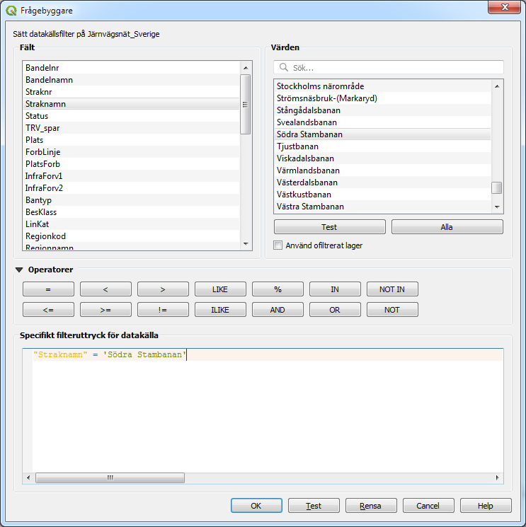{width="4.405936132983377in"
height="4.417592957130359in"}

*Figur 3.11 Frågebyggaren.*

För att testa uttrycket, tryck på knappen *Test*. Det bör komma 2.444st
matchningar, likt Figur 3.12 nedan. Tryck på knappen *OK* och därefter
*OK* igen för att stänga *Frågebyggaren*.

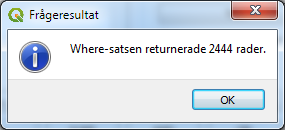{width="1.923231627296588in"
height="0.8772626859142607in"}

*Figur 3.12 Test av filteruttryck.*

Vårt lager är nu filtrerat, vilket visualiseras av en tratt vid sidan av
lagret i lagerlistan (jfr Figur 3.13 nedan). Antalet objekt är 2.444st i
lagret.

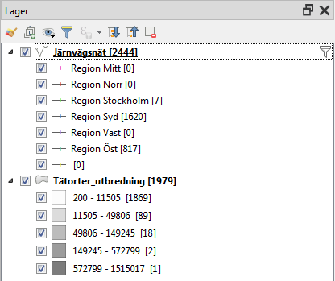{width="2.0752471566054242in"
height="1.7410115923009624in"}

*Figur 3.13 Filtrerat lager med järnvägar.*

Förändringarna vi gjort är enbart i vårt projekt -- öppnar vi datasetet
i ett annat projekt eller i ett annat program är antalet linjer
fortfarande drygt 53 000 st.

Vi vill nu utöka vårt filteruttryck genom att lägga till kriteriet att
linjen även ska vara en bro (attributet *Bro* ska vara lika med 1).
Högerklicka på lagret *Järnvägsnät Filter* och lägg till AND \"Bro\"
= 1. Här behöver vi inte ha enkla citattecken kring attributvärdet då
detta är numeriskt. Tryck på knappen *OK* och det bör då vara 541st
linjer kvar efter filtreringen. Dessa består av järnvägsbroar som ligger
på Södra stambanan. Ifall du har kategoriserad symbolsättning av
järnvägarna, kan det hända att antalet objekt för de olika kategorierna
inte visas korrekt, jfr Figur 3.14 nedan. Gå då till egenskaperna för
lagret, fliken *Symbologi* och tryck *Apply* samt därefter *OK*. Nu ska
antalet objekt för de olika klasserna visas korrekt.

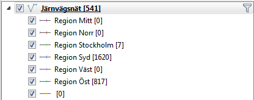{width="3.227120516185477in"
height="1.2722298775153107in"}

*Figur 3.14 Inkorrekt visning av antalet objekt för kategorierna i det
filtrerade lagret.*

### 3.9 Exportera lager {#exportera-lager .unnumbered}

Filtreringen finns för tillfället bara i vårt projekt. Som nämndes i
förra avsnittet är vår ursprungsfil orörd. För att spara resultatet av
filtreringen, högerklicka på lagret *Exportera Spara objekt som.* Välj
*GeoPackage* som format (se Appendix B för beskrivning av formatet),
peka ut en lämplig mapp och namnge filen *Broar_Södra_Stambanan*. Lämna
rutan *Lägg till sparad fil till kartan* ibockad och tryck på knappen
*OK*. Lagret sparas nu i formatet GeoPackage och läggs även till i
kartan med namnet *Broar_Södra_Stambanan*. Klicka på trattsymbolen för
lagret *Järnvägsnät*, klicka *Rensa* och därefter *OK*. Vi har nu vårt
ursprungliga lager återställt i projektet samt ett nytt lager med enbart
broar på Södra Stambanan.

Observera att det nyss tillagda, GeoPackage, lagret blir automatiskt
färgsatt med enkel symbologi. Öppna symbologin för lagret och välj t.ex.
*effect neon* från QGIS symbolbibliotek samt öka bredden till 2. Tryck
på knappen *Apply* och *OK* när du är nöjd. Figur 3.15 nedan visar en
möjlig visualisering kring kommunen Höör som exempel. I Figuren är
kommunnamnet tillagd som en etikett, vilket kommer att behandlas längre
fram i kompendiet. Spara projektet.

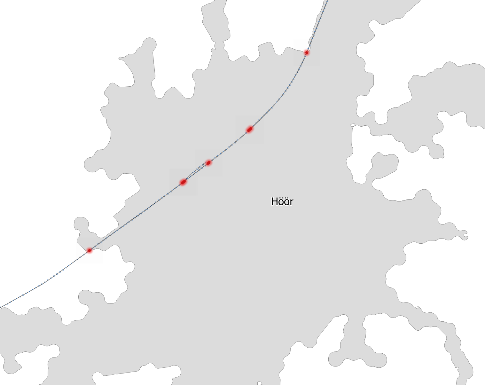{width="2.663556430446194in"
height="2.1139337270341207in"}

*Figur 3.15 Exempel på visualisering.*

## Övning -- koordinatsystem och geobearbetning

#### Inledning {#inledning-1 .unnumbered}

I denna övning använder vi ett lager med Sveriges kommuner. Vidare
kommer vi att använda geodata ifrån OpenStreetMap som innehåller
markanvändning över Danmark, i ett annat koordinatsystem. Uppgiften är
att jämföra datamängderna och hitta företeelser i Danmarks-lagret som är
inom någon svensk kommungräns.

Indata:

-   *Kommun_Sweref99TM_region.shp*

-   *gis_osm_landuse_a_free_1.shp* från datasetet/mappen
    *denmark-latest-free.shp*

Starta QGIS och välj Nytt projekt, ifall du inte redan har programmet
öppet med ett blankt projekt.

### 4.1 Hantering av koordinatsystem {#hantering-av-koordinatsystem .unnumbered}

Lägg till lagret *gis_osm_landuse_a_free_1.shp* i projektet och byt namn
på det till *Markanvändning_osm*. Projektets koordinatsystem (*CRS*)
sätts automatiskt till koordinatsystemet för det först tillagda lagret.
Använd gärna det koordinatsystem för projektet som majoriteten av dina
lager har (eller kommer att ha). Projektets koordinatsystem kan ändras i
menyn *Projekt* *Egenskaper* *Referenskoordinatsystem*.

I QGIS 3 är "o*n the fly CRS transformation"* alltid aktiverat. Detta
innebär att ett lager automatiskt projiceras om till projektets
referenskoordinatsystem när det läggs till. Skulle du upptäcka att ett
lager ligger fel placerat jämfört med andra lager, kan det bero på att
lagret blev definierat till fel koordinatsystem. För att definiera om,
högerklicka på lagret i lagerlistan och välj *Egenskaper* *Källa.* Ändra
därefter inställningen *Sätt källans koordinatreferenssystem.*

### 4.2 Projicera om projekt respektive lager {#projicera-om-projekt-respektive-lager .unnumbered}

Lägg till lagret med Sveriges kommunytor,
*Kommun_Sweref99TM_region.shp.* Den ursprungliga filen ligger i
koordinatsystemet SWEREF99TM (EPSG:3006) och kommer automatiskt att
projiceras om till WGS84 (EPSG:4326).

Vi önskar att arbeta helt i EPSG:3006 i vårt projekt och väljer därför
att projicera om hela projektet. Öppna fönstret *Projektegenskaper \|
Referenskoordinatsystem* genom att i menyn välja *Projekt* *Egenskaper*
*Referenskoordinatsystem*. Filtrera listan med referenskoordinatsystem
genom att skriva "3006" i rutan högst upp (jfr Figur 4.1 nedan).
Dubbelklicka på namnet och kontrollera att SWEREF99 TM nu står i rutan
*Valt referenskoordinatsystem.* Tryck därefter på knappen *OK*.

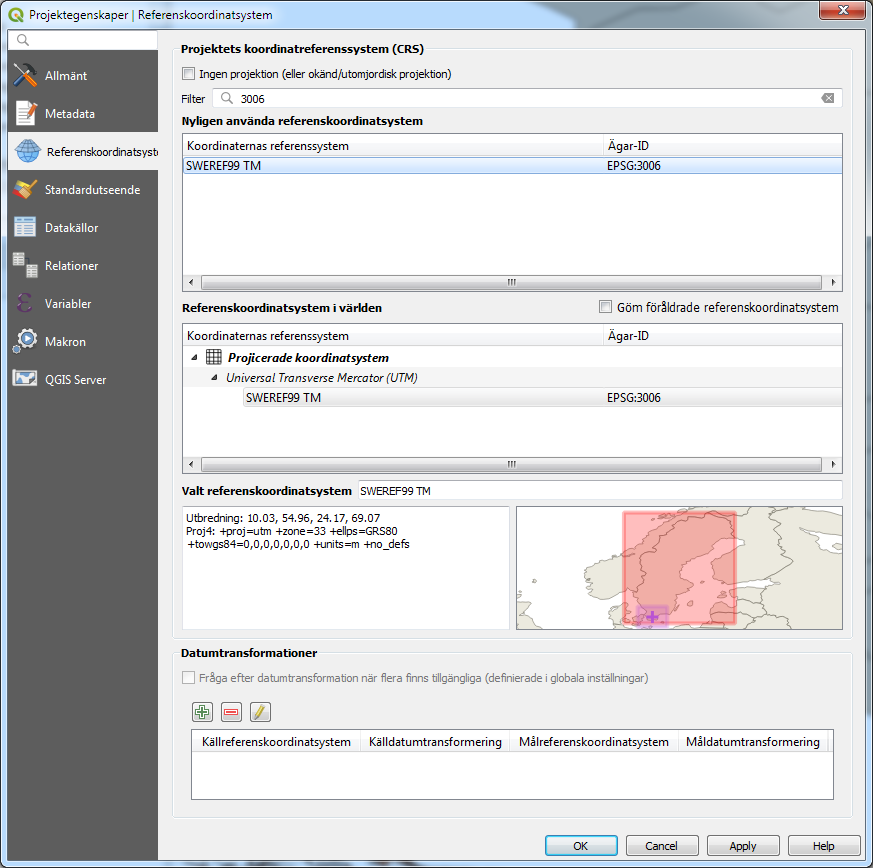{width="3.9738779527559056in"
height="3.951101268591426in"}

*Figur 4.1 Projicera om projekt.*

Projektet har nu projicerats om till EPSG:3006. För vi muspekaren över
OpenStreetMap-lagret ser vi att koordinatsystemet för källan fortfarande
är EPSG:4326 (jfr Figur 4.2 nedan). Vi manipulerar således inte
datakällan, utan enbart hur data representeras i projektet.

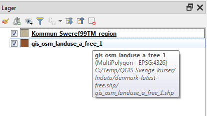{width="3.3541666666666665in"
height="1.8742279090113736in"}

*Figur 4.2 Källans koordinatsystem är fortfarande EPSG:4326.*

För att projicera om ett lager måste vi använda verktyget *Projicera om
lager.* Öppna panelen *Geobearbetning verktygslåda* genom att i menyn
välja *Geobearbetning* *Verktygslåda*. Sök upp verktyget och
dubbelklicka på det. För att projektionen ska bli rätt är det viktigt
att det ursprungliga koordinatsystemet för lagret är korrekt angivet.
Ange indatalager och målprojektion enligt Figur 4.3 nedan, klicka
därefter på knappen *Kör*.

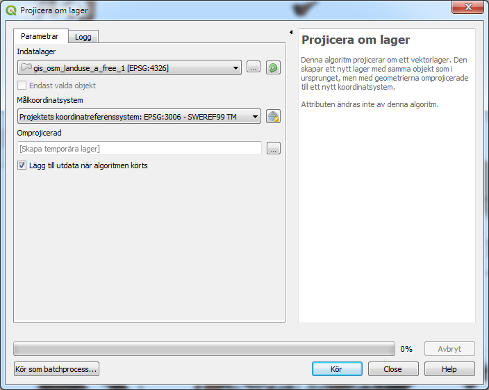{width="3.4129604111986in"
height="2.7196095800524933in"}

*Figur 4.3 Projicera om lager till EPSG:3006.*

Då algoritmen är klar har vi ett nytt temporärt lager kallat
*Omprojicerad*. För vi muspekaren över detta lager ser vi att det ligger
i EPSG:3006 (som i Figur 4.4 nedan). Ifall vi skulle behöva även en
datakälla i EPSG:3006, har vi nu ett lager vi kan välja att exportera
till önskat format. Det räcker dock bra med att arbeta vidare med lagret
som projicerats om i projektet, varför vi kan ta bort lagret
*Omprojicerad* genom att högerklicka på det *Ta bort lager*.

{width="6.291666666666667in"
height="1.1805555555555556in"}

*Figur 4.4 Omprojicerat lager.*

###  {#section .unnumbered}

### 4.3 Redigera data {#redigera-data .unnumbered}

Högerklicka på lagret med markanvändning *Växla redigeringsläge*. Klicka
därefter på knappen *Välj objekt med...*
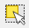{width="0.25372265966754154in"
height="0.23834536307961504in"}*.* Markera merparten av Danmark som
ligger en bra bit ifrån Sverige och tryck delete på tangentbordet. Glöm
inte ön Bornholm sydost om Skåne.

Sök efter verktyget *Klipp* i panelen *Geobearbetning verktygslåda*.
Välj verktyget *Klipp* i underkategorin *Vektorlager* genom att
dubbelklicka på det. Manövern med att ta bort stora delar av lagret med
markanvändning var helt enkelt för att snabba på processeringen av
Klipp-verktyget. Dialogrutan *Klipp* som öppnas ställs in som i Figur
4.5 nedan. Indatalager är vårt kommunlager och OpenStreetMap-lagret med
markanvändning är överlagringslagret.

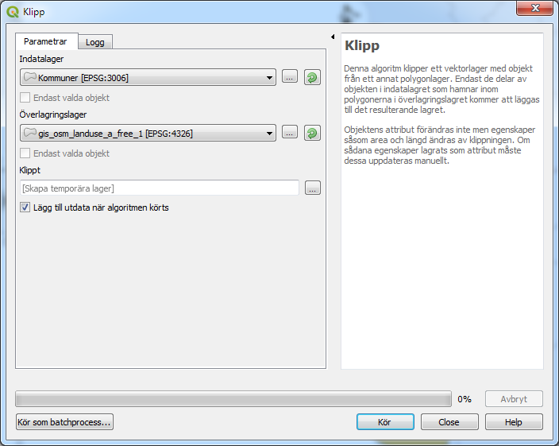{width="4.060044838145232in"
height="3.2352373140857393in"}

*Figur 4.5 Verktyget Klipp*

För att förstå verktyget *Klipp*, föreställ dig att indatalagret
(kommunytorna i vårt fall), är pepparkaksdegen och att
överlagringslagret (markanvändningsytorna) är pepparkaksformarna.
Resultatet av klippningen blir den pepparkaksdeg som helt eller delvis
hamnar inom formarna. Resultatet hamnar som standard som ett temporärt
lager och läggs till i lagerträdet när körningen är klar (rutan *Lägg
till utdata när algoritmen körts* är ibockad). Då algoritmen är klar,
tryck på knappen *Close*.

I lagerträdet finns nu lagret *Klippt* och syns även i kartvyn. Byt namn
till något bättre samt visa antalet objekt för lagret (bör vara 1st).
Öppna även attributtabellen och kontrollera att attributen kommit med
ifrån kommunytorna. Notera även symbolen till höger om lagernamnet som
indikerar att lagret endast är temporärt och kommer att försvinna då vi
stänger projektet, ifall vi inte sparar det. Spara därför lagret på
lämplig plats.

## Ansluta till databas

### 5.1 Inledning {#inledning-2 .unnumbered}

QGIS kan hantera en mängd olika datakällor, varav vi hittills har
fokuserat på vektorlager. I nästa övning tittar vi närmre på
rasterhantering. Längre fram i kompendiet går vi igenom hur vi kan
arbeta med data i form av WMS-tjänster (*Web Map Service)* och csv-filer
(*comma-separated values)*. Detta avsnitt behandlar fallet då vi har en
databas som datakälla.

### 5.2 PostGIS {#postgis .unnumbered}

PostGIS är ett spatialt tillägg till PostgreSQL databashanterararen.
Såväl PostgreSQL som PostGIS är skrivna i öppen källkod. Nedan visas
exempel på hur det går att lägga till ett lager i QGIS från PostGIS.
Installation och konfiguration av PostGIS ligger utanför detta
kompendiums ramar. Är du mer intresserad av möjligheterna med PostGIS,
se <https://postgis.net> för information och nedladdning.

Ett PostGIS-lager läggs till via *Lager Lägg till lager Lägg till
PostGIS-lager*. Dialogrutan *Datakällor \| PostgreSQL* öppnas. Först
måste en anslutning definieras, därefter kan QGIS komma åt PostGIS via
denna anslutning. Via knappen *Ny* öppnas ett nytt fönster där vi anger
information om anslutningen. Figur 5.1 nedan visar exempel på hur
anslutningsinformationen kan se ut mot en lokal installation av PostGIS.

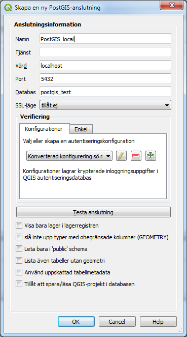{width="2.6225853018372702in"
height="4.70501968503937in"}

*Figur 5.1 Anslutning till PostGIS*

Då anslutningen lagts till kan vi använda den för att koppla oss till
databasen via knappen *Anslut*. Tabeller från PostGIS läses in, se Figur
5.2 nedan för ett exempel.

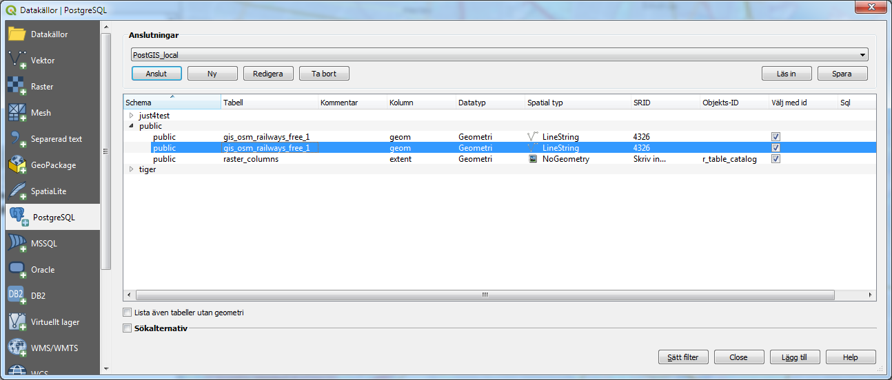{width="5.185165135608049in"
height="2.2119258530183727in"}

*Figur 5.2 Uppkoppling mot en PostGIS-databas.*

I detta exempel finns bl.a. ett lager med Danmarks järnvägar från
OpenStreetMap i databasen. Efter att ha lagt till detta i kartvyn,
tillsammans med en bakgrundskarta från OpenStreetMap (via ett s.k.
*insticksprogram,* se vidare om detta i kapitel 12), ser kartvyn ut som
i Figur 5.3 nedan efter en del symbolisering. Vidare visas i Figur 5.3
rutan Databashanteraren, där vi kan skriva frågor mot tabellerna i
PostGIS för att filtrera vad vi hämtar därifrån.

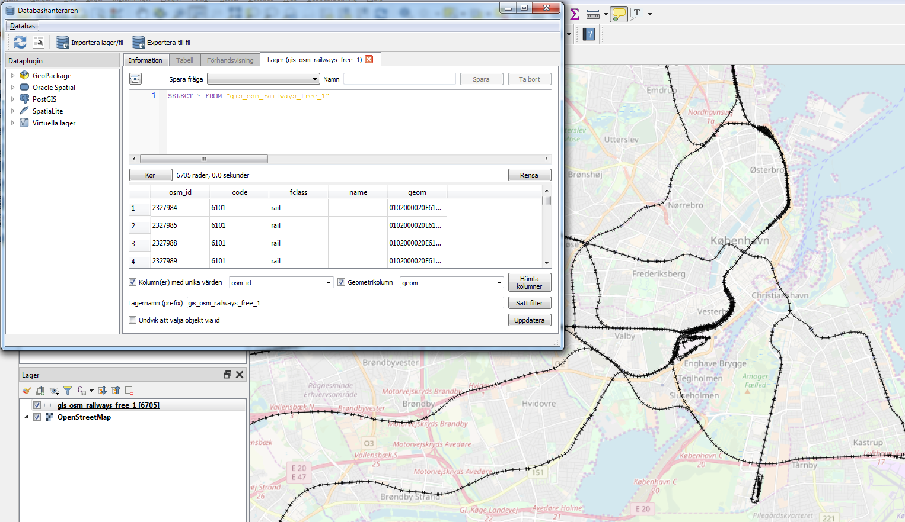{width="6.3in"
height="3.640972222222222in"}

*Figur 5.3 Rutan Databashanteraren samt ett PostGIS-lager tillagt i
QGIS-projektet.*

###  5.3 SpatiaLite {#spatialite .unnumbered}

Databashanteraren *SQlite* ryms inom en enda fil, vilket gör den ideal
för att byggas in som en del i olika applikationer. *SpatiaLite* är ett
spatialt tillägg till SQlite, motsvarande vad PostGIS är gentemot
PostgreSQL. En begränsning med denna databashanterare är att det inte
går att sätta rättigheter i databasen, utan det får i så fall hanteras
med rättigheter för själva filen i filsystemet.

I avsnitt 6.8 visas hur det går att exportera till SpatiaLite samt även
hur det därefter går att använda exporten som datakälla.

## Övning -- hantera rasterdata och skapa etiketter

### 6.1 Inledning {#inledning-3 .unnumbered}

I denna övning tittar vi närmre på rasterhantering. Data kommer ifrån
Lantmäteriet, produkten GSD-Höjddata, grid 50+ nh. Produkten innehåller
bl.a. ett lager med höjdvärden på marken i ett rutnät med 50m upplösning
(mer information:
<https://www.lantmateriet.se/globalassets/kartor-och-geografisk-information/hojddata/hojd50_plus_nh.pdf>).

Indata:

-   filen *nh_12_Skane_lan_Sweref_99_TM_geotiff.zip* uppackad på
    filsystemet.

Starta QGIS och välj Nytt projekt, ifall du inte redan har programmet
öppet med ett blankt projekt.

### 6.2 Lägg till rasterlager {#lägg-till-rasterlager .unnumbered}

Tryck på knappen *Lägg till rasterlager*
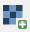{width="0.2284514435695538in"
height="0.2436832895888014in"} i verktygsfältet *Hantera lager* till
vänster i gränssnittet. Rutan *Datakällor \| Raster* öppnas. Vid
inställningen för *Rasterdataset,* klicka på knappen
{width="0.19143044619422572in"
height="0.16532589676290463in"} och leta upp mappen med rasterbilderna
på filsystemet. Markera alla fyra rasterbilderna och tryck *Öppna*.
Tryck därefter *Lägg till*, notera att rasterbilderna läggs till i
kartvyn, och tryck slutligen på *Close*. Den inlästa geodatan ska se ut
som Figur 6.1 nedan.

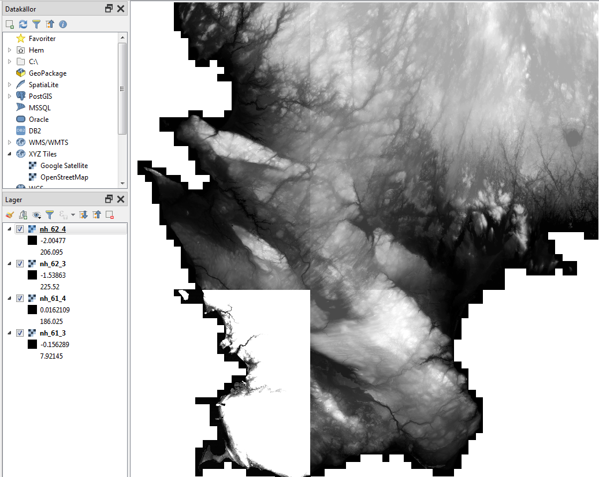{width="4.671218285214348in"
height="3.720703193350831in"}

*Figur 6.1 Inlästa rasterlager med höjddata.*

För att lättare hålla reda på de fyra lagren byter vi namn på dem.
Lagret nere till vänster, *nh_61_3,* ger vi namnet *sv* (för sydväst).
Lagret uppe till höger, *nh_62_3*, ger vi namnet *nv*. På liknande sätt
byter vi namn på lagret *nh_62_4* till *no* samt slutligen döps lagret
*nh_61_4* till *so*.

### 6.3 Lagergrupper {#lagergrupper .unnumbered}

Lager struktureras ofta i *lagergrupper* utefter hur de hör ihop, t.ex
utefter geometrityp eller annan logik. Lagergrupper är särskilt
användbart när det börjar bli många lager i lagerlistan.

Lägg till en lagergrupp genom att högerklicka i en tom yta i panelen
*Lager Lägg till grupp* (jfr. Figur 6.2 nedan). Namnge gruppen
*NH_50m_grid*. Markera därefter de fyra rasterlagren och dra dem till
den nyss skapade gruppen.

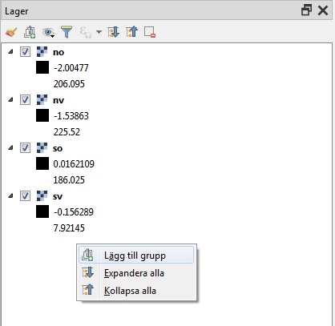{width="2.4177930883639545in"
height="2.3541666666666665in"}

*Figur 6.2 Lägga till lagergrupp.*

Ett alternativt sätt att skapa en lagergrupp är att markera ett eller
flera lager, högerklicka på ett utav dessa och välja gruppera.

Lagergruppen med de ingående lagren ser nu ut som Figur 6.3 nedan. Prova
att dölja/visa alla lagren genom att klicka ur/i gruppens ruta. Prova
vidare knapparna för att Expandera/slå igen lagergrupper
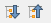{width="0.53125in"
height="0.23958333333333334in"} och testa slutligen att klicka på pilen
till vänster om lagergruppen, som har samma funktion per lagergrupp som
de nyss nämnda knapparna.

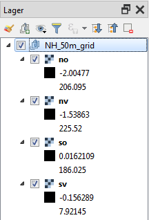{width="2.25in" height="3.3125in"}

*Figur 6.3 Lagergrupp med tillagda rasterlager.*

### 6.4 Bandrendering {#bandrendering .unnumbered}

De rasterfiler vi arbetar med har enbart ett band och som standard
symboliseras detta med en gråskala från svart till vit. De högsta
värdena för lagret ligger mot det vita hållet och vice versa. Observera
att t.ex. lagret *sv* har höjdvärden upp till cirka 8m, medan t.ex.
lagret *nv* har värden upp till cirka 225m. Respektive lagers maximala
höjder renderas vitt, vilket blir lite förvirrande då vi har alla lager
tända samtidigt. Det finns några olika metoder för att slå samman
rasterbilder, t.ex. går det att bygga ett virtuellt raster utifrån flera
rasterbilder. Vi går inte in på det mera här, men det är bra att känna
till.

Fortsätt visa lagret *nv* och dölj övriga lager. Högerklicka därefter på
*nv* i lagerlistan *Duplicera lager.* En kopia av lagret *nv* läggs till
i lagerlistan med namnet *"nv kopia".* Observera att dessa bägge lager
använder samma datakälla! I fortsättningen av detta kapitel, testas
olika sätt att visualisera höjddata och det kan vara bra att jämföra
resultatet från de olika teknikerna med varandra. Därav det duplicerade
lagret.

Högerklicka på lagret *nv kopia* i lagerlistan *Egenskaper* och välj
fliken *Symbologi*. Det finns en rad inställningar för symbologin, här
koncentrerar vi oss på den översta gruppen, *Bandrendering*, vars
inställningar ser ut som nedan i Figur 6.4.

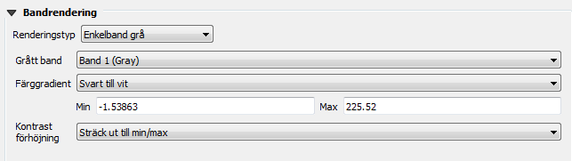{width="6.3in"
height="1.773611111111111in"}

*Figur 6.4 Bandrendering, inställningar.*

Byt renderingstyp till *Enkelband pseudofärg* och välj något spektrum i
rullistan vid inställningen för *Färggradient*, t.ex. *Greens*. Välj
*Kvantil* på inställningen *Läge*, för att gruppera cellerna i
kvantiller utefter sina höjdvärden. Tryck på knappen *Apply* för att se
förändringarna direkt utan att stänga *Lageregenskaperna* (jfr. Figur
6.5 nedan för en möjlig visualisering). Tryck på knappen *OK* när du är
nöjd med utseendet. Byt därefter namn på lagret *nv kopia* till
*nv_pseudo.*

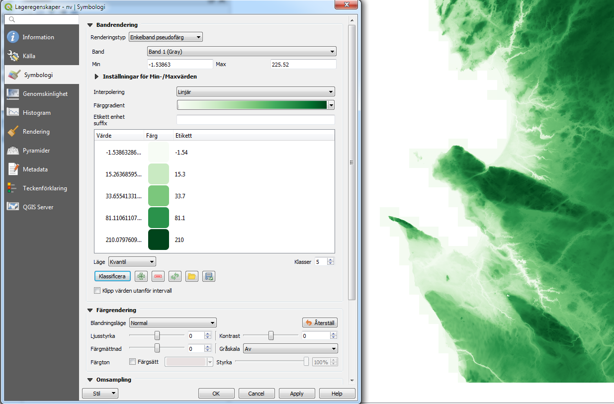{width="5.907444225721785in"
height="3.8888068678915135in"}

*Figur 6.5 Bandrendering av höjddata med pseudofärg.*

### 6.5 Terrängskuggning {#terrängskuggning .unnumbered}

Vi ska nu testa renderingstypen terrängskuggning, för att få en
3D-effekt av terrängen. Högerklicka på lagret *nv* *Egenskaper*, fliken
*Symbologi*. Välj *Terrängskuggning* som *Renderingstyp*, ändra
z-faktorn till 3 och tryck på knappen *OK*. Kontrollera resultatet och
testa att välj z-faktor 4 istället för att få en ännu mera markerad
terrängskuggning, jfr Figur 6.6 nedan. Fort får vi en intressant
visualisering av terrängen, som fungerar utmärkt för att ge en
översiktlig förståelse av höjdförhållandena. Byt namn på lagret *nv*
till *nv_terräng.*

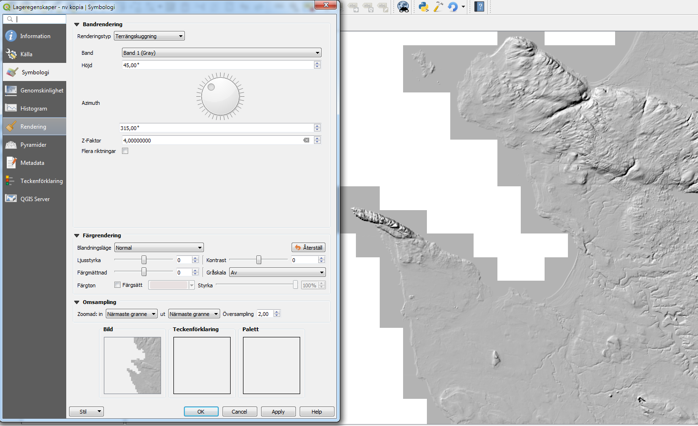{width="5.709528652668417in"
height="3.4841207349081365in"}

*Figur 6.6 Bandrendering av höjddata med terrängskuggning.*

### 6.6 Höjdkurvor {#höjdkurvor .unnumbered}

I QGIS finns ett verktyg som gör det möjligt för oss att extrahera
höjdkurvor ifrån rasterlager. Välj i menyraden *Raster Extrahera
Höjdkurvor*. Fönstret *Höjdkurvor* öppnas, jfr inställningarna i nästa
stycke med Figur 6.7 nedan.

Sätt Indatalager till något utav *nv*-lagren och ändra *Intervall mellan
höjdkurvor* till 5. Tryck på knappen *Kör* samt knappen *Close* när
algoritmen är färdig. Vi har nu ett nytt temporärt lager, *Höjdkurvor* i
lagerlistan.

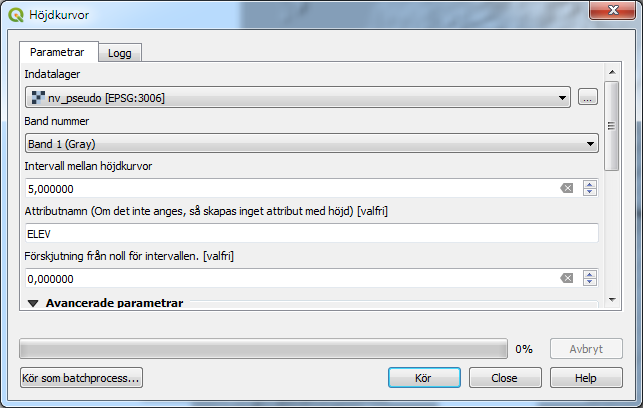{width="5.692564523184602in"
height="3.611816491688539in"}

*Figur 6.7 Dialogrutan för att extrahera höjdkurvor från raster.*

Vi ser genast att resultatet ser bra ut på en översiktlig nivå av
lagret. Landskapets höjdförhållanden framträder tydligt.

{width="5.519475065616798in"
height="5.298013998250219in"}

*Figur 6.8 Extraherade höjdkurvor.*

### 6.7 Etiketter {#etiketter .unnumbered}

Vi kommer nu att etikettera höjdkurvorna. Börja med att skriva i skalan
1:5000 i statusfältet för att komma till ett rimligt zoomläge för att
kunna se och jobba med etiketterna i det följande. Se även till att det
finns några höjdkurvor i kartvyn.

Högerklicka på lagret *Höjdkurvor Egenskaper*, välj fliken *Etiketter*.
Vi väljer först *Enkla etiketter* samt attributet *ELEV* i valet för
*Etikettera med*. Tryck på knappen *Apply* och kontrollera i kartvyn att
höjdkurvorna har etiketterats med höjdkurvornas värden. Se Figur 6.9
nedan för inställningar samt ett exempel på hur kartvyn kan se ut. Som
framgår av figuren ger det ett plottrigt intryck att ha en etikett för
varje 5m kurva.

{width="6.251768372703412in"
height="2.8550568678915136in"}

*Figur 6.9 Inställningar för etiketter samt hur de syns i kartvyn t v i
figuren.*

Istället för *Enkla etiketter*, välj *Regelbaserad etikettering*. Tryck
på knappen 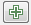{width="0.2757458442694663in"
height="0.2223753280839895in"} och rutan *Redigera regel* dyker upp. Vi
vill skapa en regel som skriver ut etiketter vid jämna 10m höjdkurvor,
ge därför regeln namnet *10m_etiketter* i inställningen för
*Beskrivning*. Vid inställningen för *Filter*, tryck på knappen
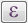{width="0.2916666666666667in"
height="0.23958333333333334in"} för att öppna uttrycksbyggaren. Skriv in
*ELEV* i sökrutan i mitten för att filtrera valen och dubbelklicka på
attributet *ELEV* i gruppen *Fält och värden*. Fyll därefter på
uttrycket i vänstra rutan till att bli \"ELEV\" LIKE \'%0\'. Jämför med
Figur 6.10 nedan. Uttrycket kommer att matcha alla höjdkurvor, vars
värde för attributet *ELEV* slutar med en nolla. Tryck på knappen *OK*.

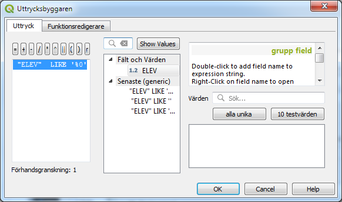{width="3.649202755905512in"
height="2.1631878827646545in"}

*Figur 6.10 Uttryck för att matcha höjdkurvor med jämna 10-tals meter.*

För inställningen *Etikettera med* i rutan *Redigera regel*, välj
*ELEV*. För stilsättning av själva etiketten finns en rad kategorier av
inställningar, från att ställa in typsnittet till att justera positionen
eller sätta en bakgrund. Här nöjer vi oss med att ändra storleken till 8
punkter i kategorin *Text*, för att etiketterna inte ska bli så
framträdande. Testa den regelstyrda etiketteringen genom att trycka på
knappen *Apply* och se efter i kartvyn att etiketter för jämna 10-tals
meter skrivs ut. Jämför med nedan Figur 6.11 och tryck sedan på knappen
*OK.*

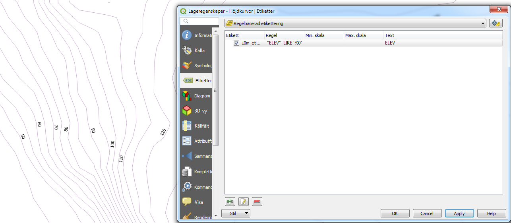{width="6.11489501312336in"
height="2.667852143482065in"}

*Figur 6.11 Regelbaserad etikettering med jämna 10-tals meter samt hur
etiketterna syns i kartvyn t v i figuren.*

### 6.8 SpatiaLite för export och datakälla {#spatialite-för-export-och-datakälla .unnumbered}

Högerklicka på lagret *Höjdkurvor Exportera Spara objekt som*. Välj
*SpatialLite* som format (jfr avsnitt 5.3), ge den namnet
*Höjdkurvor_spatialite* och peka ut en lämplig plats att spara filen på.
Bocka ur rutan *Lägg till sparad fil till kartan* och tryck därefter på
knappen *OK.* En bekräftelse på sparad fil dyker upp, men inget nytt
lager läggs till projektet.

Vi ska nu testa att lägga till ett SpatiaLite-lager. Gå till menyraden
*Databas Databashanteraren.* Högerklicka därefter på SpatiaLite i listan
under *Dataplugin* och välj *Ny anslutning*, jämför bild 6.12 nedan.

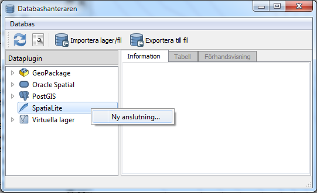{width="4.452699037620297in"
height="2.71499343832021in"}

*Figur 6.12 Skapa ny SpatiaLite anslutning i rutan Databashanteraren.*

Eftersom SpatiaLite-formatet enbart är en fil (jfr avsnitt 5.3), ska vi
enbart peka ut den nyss sparade SpatiaLite-filen och trycka knappen
*Öppna* för att ha skapat en ny anslutning. Databasen dyker upp till
vänster i listan *Dataplugin* under *SpatiaLite,* jfr Figur 6.13 nedan.
Expandera databasen i listan och dubbelklicka på tabellnamnet för att
lägga till tabellen i lagerlistan (se Figur 6.13). Det går även att
förhandsgranska tabellen direkt i *Databashanteraren* via fliken
*Förhandsvisning.* Notera att det tillagda SpatiaLite-lagret saknar den
etikettering vi gjort inom projektet för lagret *Höjdkurvor.* Stäng
databashanteraren och spara projektet.

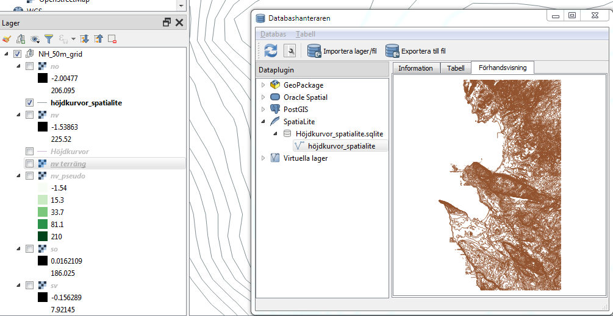{width="6.3in"
height="3.2534722222222223in"}

*Figur 6.13 SpatiaLite-lager tillagt i QGIS-projektet.*

## Övning -- WMS tjänster

### 7.1 Inledning {#inledning-4 .unnumbered}

WMS, *Web Map Service*, är en teknik för att tillhandahålla kartbilder
över internet. WMS är ett bra alternativ till att behöva ladda hem data.
Är tjänsten rätt uppsatt och underhållen får du snabbt aktuella data
direkt i t.ex. QGIS. Är WMS-tjänsten även öppen, d.v.s. inte kräver
någon form av autentisering, är det enda du behöver en URL för att QGIS
ska kunna konsumera WMS-tjänsten.

Starta QGIS och välj Nytt projekt, ifall du inte redan har programmet
öppet med ett blankt projekt.

### 7.2 Berggrunder som WMS-tjänst {#berggrunder-som-wms-tjänst .unnumbered}

Nedan används en WMS ifrån SGU (Sveriges Geologiska Undersökning) som
visar berggrund. För att se metadata om tjänsten eller hitta andra
WMS-tjänster från SGU, se
<https://www.sgu.se/produkter/geologiska-data/vara-data-i-visningstjanster/>.

Tryck på knappen *Lägg till WMS/WMTS-lager*
{width="0.23914260717410324in"
height="0.22547681539807524in"}till vänster. Dialogrutan *Datakällor \|
WMS/WMTS* öppnas, jfr Figur 7.1 nedan. För tillfället finns inga
anslutningar, därav det tomma fältet i mitten.

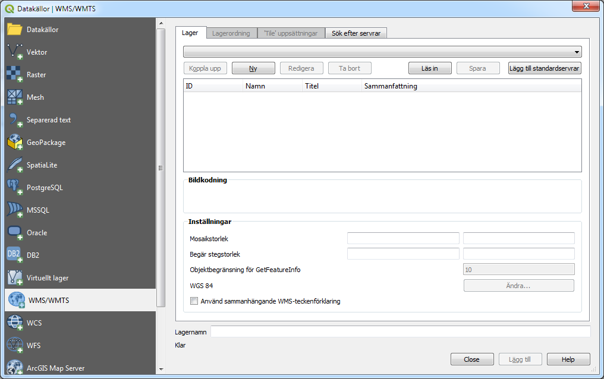{width="6.3in" height="3.95625in"}

*Figur 7.1 WMS/WMTS*

Tryck på *Ny* för att definiera en ny anslutning. Dialogrutan *Skapa en
ny WMS/WMTS-anslutning* öppnas. Här skriver du i länken
<https://resource.sgu.se/service/wms/130/berggrund_1M> i fältet *URL*
samt namnger anslutningen till något lämpligt, t.ex. SGU. Tjänsten
kräver ingen autentisering, utan lämna dessa och övriga inställningar
som de är. Jämför med Figur 7.2 nedan och tryck därefter *OK* för att
bekräfta din anslutning och stänga dialogrutan med anslutningen.

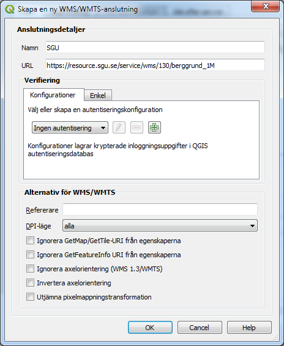{width="3.1017147856517937in"
height="3.776871172353456in"}

*Figur 7.2 Skapa WMS-anslutning till berggrunder från SGU.*

I den fortfarande öppna rutan med WMS/WMTS datakällor finns nu
anslutningen *SGU* valbar i listan över anslutningar. Tryck på knappen
*Koppla upp* och rutan i mitten kommer att fyllas på med tillgängliga
skikt från tjänsten. Välj det som har titel *Berggrundsytor* samt sätt
referenskoordinatsystem till SWEREF99 TM m h a knappen *Ändra* längst
ned. Jämför med Figur 7.3 nedan och klicka därefter Lägg till samt
Close.

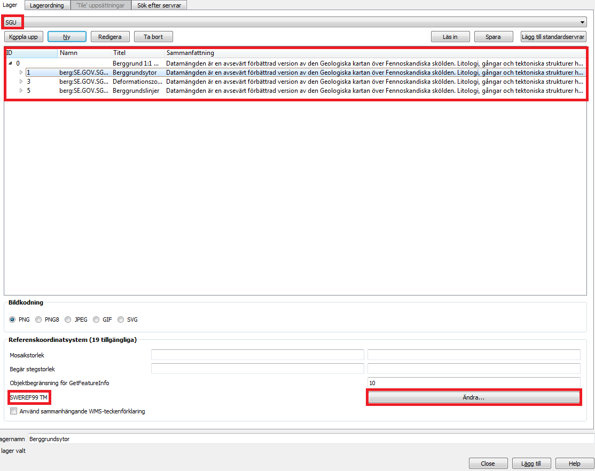{width="4.99959208223972in"
height="3.962263779527559in"}

*Figur 7.3 Inställningar för WMS-uppkopplingen mot SGU.*

Till kartvyn läggs nu ett synnerligen färgglatt lager med berggrunder i
Sverige, jfr Figur 7.3 nedan. Symbolsättningen kan vi inte påverka, vi
konsumerar enbart de färdigskapade bilderna.

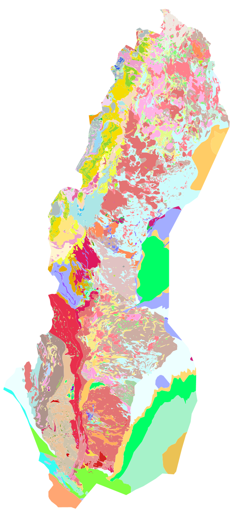{width="1.3818383639545058in"
height="3.0312150043744532in"}

*Figur 7.3 Berggrunder i Sverige, källa WMS från SGU.*

Högerklicka på lagret *Berggrundsytor* *Egenskaper* och välj fliken
*Information*. Här finns en del metadata om lagret, jfr Figur 7.4 nedan.
Välj även fliken *Symbologi* och notera att vi har begränsade
möjligheter att påverka hur lagret ser ut. Stäng därefter fönstret
lageregenskaper.

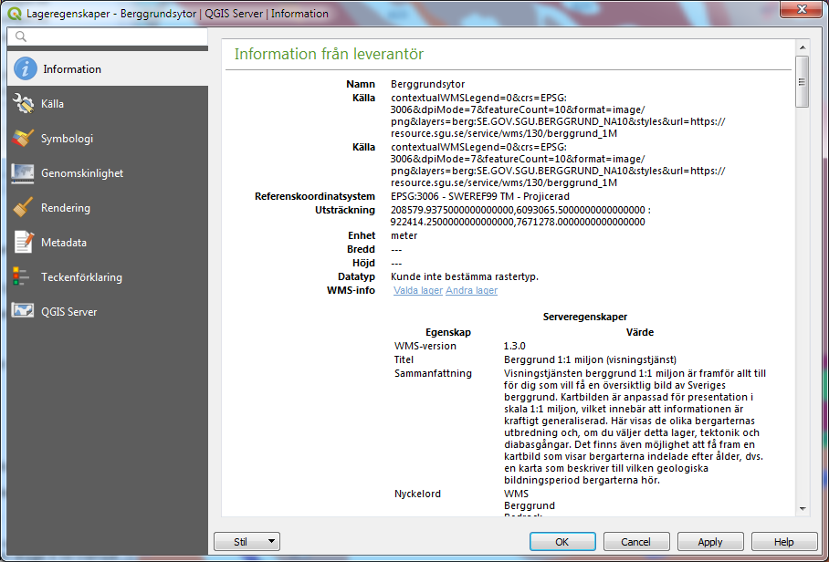{width="5.237687007874015in"
height="3.553567366579178in"}

*Figur 7.4 Metadata om WMS-tjänsten.*

Välj ut något mindre område att zooma in över och välj därefter
verktyget *Identifiera objekt*
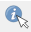{width="0.17770669291338584in"
height="0.18343941382327209in"}. Via WMS-protokollet hämtas information
kring punkten där vi klickade, vilket vi ser i panelen
*Identifieringsresultat* till höger i Figur 7.5 nedan. Stäng därefter
panelen identifieringsresultat, klicka på Zooma Allt samt minimera
lagret *Berggrundsytor* i panelen *Lager* genom att klicka på pilen till
vänster om lagernamnet. Nu är vi redo att lägga till ännu ett WMS-lager.

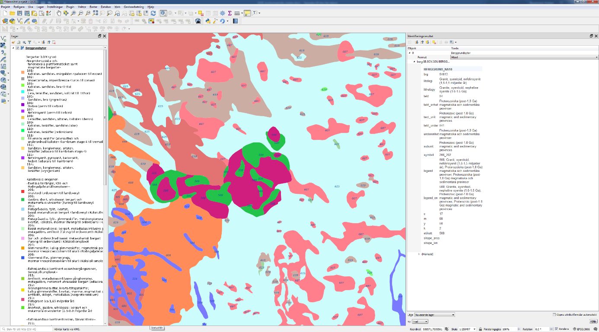{width="6.3in" height="3.5in"}

*Figur 7.5 Identifieringsresultat via WMS-protokollet.*

### 7.3 Skyddade naturområden som WMS-tjänst {#skyddade-naturområden-som-wms-tjänst .unnumbered}

I Naturvårdsverkets miljödataportal
(<http://mdp.vic-metria.nu/miljodataportalen/>) finns en rad olika
WMS-tjänster (botanisera gärna!). Här kommer vi att lägga till en
WMS-tjänst som visar skyddade naturområden, bl.a. nationalparker och
naturreservat.

Följ stegen i förra avsnittet för att lägga till en ny WMS-anslutning.
Namnge den till något lämpligt. Inställningen för *URL* ska vara:

<http://gis-services.metria.se/ArcGIS/services/InspireNV_NVR/MapServer/InspireViewService?layers=PS.NR>.
Koppla upp dig mot tjänsten då du lagt till anslutningen. Välj ett lager
som verkar intressant, t.ex. nationalparker. Sätt bildkodningen till
PNG, kontrollera att referenskoordinatsystemet är satt till SWEREF99 TM
samt klicka på knappen *Lägg till* och därefter *Close*.

Naturvårdsverkets WMS-tjänst kommer att hamna över SGU:s i lagerlistan.
WMS-tjänster är oftast inte tänkta att användas i samma kartvy,
åtminstone inte när de kommer från olika källor. Därav blir symbologin
svår att tyda. Visa och dölj de olika lagren för att lättare urskilja
vad som hör till respektive WMS-tjänst. Sätts t.ex. genomskinligheten på
berggrunderna till 50% via lageregenskaperna, blir det något enklare att
tyda i kartvyn (jfr Figur 7.6 nedan).

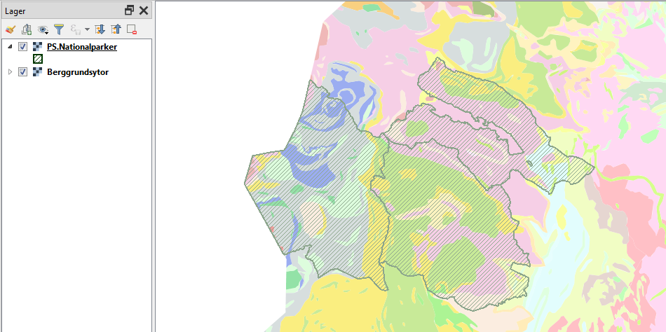{width="5.33597987751531in"
height="2.662108486439195in"}

*Figur 7.6 Två WMS-lager i kartvyn, varav den ena gjorts halvt
genomskinlig för att de lättare ska kunna tolkas.*

Använd identifieringsverktyget även för denna WMS-tjänst. Klicka på
något ställe där det finns en nationalpark och notera att
identifieringsresultatet visar information för det lager du för
tillfället har selekterat i lagerlistan. Vidare kan vi i strukturen för
resultatvisningen se att det är skillnader mellan lagren avseende hur
resultatet hämtas ifrån de olika WMS-servrarna.

Spara projektet och stäng det därefter via menyraden *Projekt Stäng.*
Projektet stängs och QGIS startsida visas. Det nyss stängda projektet
bör finnas överst i listan över *Senaste projekt*. Dubbelklicka på raden
för projektet och det kommer att öppnas.

## Georeferera bild

### 8.1 Om georeferering {#om-georeferering .unnumbered}

Att georeferera en bild innebär att man skapar en digital geografisk
referens till bilden. Detta möjliggör att bilden kan visas på rätt
placering i ett GIS program tillsammans med annan data.

Man kan till exempel georeferera en gammal karta eller en vandringsled.
Nedan visas en bild på hur en karta från 1876 över Caroli-kvarteret i
Malmö georeferats in i dagens kartbild från OpenStreetMap.

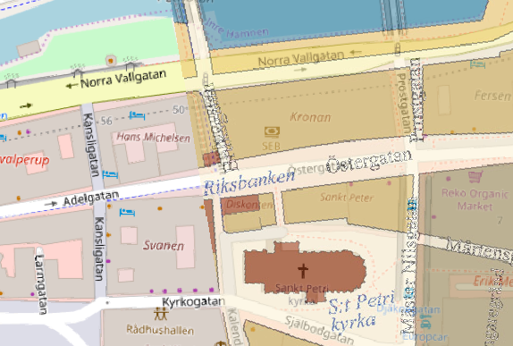{width="4.025239501312336in"
height="2.7138812335958007in"}

*Figur 8.1 Georefererad bild.*

### 8.2 Georeferering i QGIS {#georeferering-i-qgis .unnumbered}

Välj den bild som du vill ska georefereras. Det är bra om bilden har
många referenspunkter som kan passas till kartan. Om du vill testa med
Malmökartan från 1876 ovan så finns den här (released to the public
domain): <https://commons.wikimedia.org/wiki/File:Caroli_City_Malmo.jpg>

Starta ett nytt projekt och lägg till en lämplig bakgrundskarta genom
att ladda ner insticksprogrammet *QuickMapServices* eller genom att
använda *XYZ-tiles*.

Välj den kartprojektion till ditt projekt som ser ut att överensstämma
bäst med din bild (se övningen i kapitel 4 för hur du ställer in
projektionen). Du kan testa olika projektioner och jämföra formen på
kartan med den på bilden. *En tumregel kan vara att ju större området är
desto påverkan kan projektionen ge.* I detta fall är området mycket
litet så de flesta projektioner borde fungera bra. SVEREF99TM har
använts i bilden ovan. Du aktiverar *Georefererare GDAL* genom att välja
alternativet i menyn *Plugin,* jfr Figur 8.2 nedan. Efter aktivering
kommer alternativet *Georefererare...* att komma upp som ett alternativ
under menyn *Raster*.

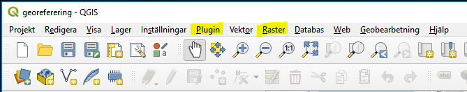{width="6.3in"
height="1.2527777777777778in"}

*Figur 8.2 Georeferering i menyraden under Raster.*

Klicka på *Georefererare...* och ett nytt fönster öppnas där du kan
lägga till bilden du vill georeferera samt välja koordinatsystem, vilket
fördelaktigt sätts som samma som den för projektet.

Placerara ut referenspunkter genom att klicka på en känd punkt på din
bild och sedan på motsvarande punkt i kartan. Välj *Från kartbladet* (se
Figur 8.3 nedan) när alternativet kommer upp och programmet kommer
automatiskt växla till kartan. Om du känner till koordinaterna för
punkten du markerade kan du välja att istället skriva in dem här. I
bägge fallen behöver du acceptera refereringen genom att trycka på
knappen *OK*.

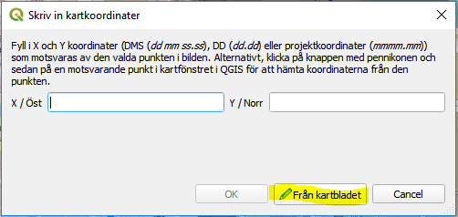{width="5.229166666666667in"
height="2.4791666666666665in"}

*Figur 8.3 Hämta koordinater från kartbladet.*

Det är bra att sätta ut många punkter som överensstämmer och ju bättre
spridning dessa har över bilden, desto bättre blir resultatet. Så länge
Georefererar-fönstret är öppet, är det möjligt att testa resultatet och
sedan fortsätta med att sätta ut eller flytta punkterna.

För att testa resultatet kan du välja *Transformatorvy* under
*inställningar*. Testa igenom vilken som passar bäst. Genom att markera
valet *Läs in i QGIS när färdig*, skapas ett nytt lager med din bild som
läggs till i projektet.

Jämför resultatet exempelvis genom att göra den överliggande bilden mer
transparant, eller genom att tända och släcka lagret. Om du inte är
riktigt nöjd med resultatet kan du alltid gå tillbaka till
*Georefereraren* igen och testa att ändra punkterna eller
*Transformatorvy*.

## Punkter i en yta

### 9.1 Inledning {#inledning-5 .unnumbered}

Detta kapitel behandlar en vanlig typ av rumslig frågeställning: hur
många punkter finns inom en yta? Detta exemplifieras här genom en
datamängd med punktgeometri ifrån Riksantikvarieämbetet samt Sveriges
kommunytor från SCB, vilka vi redan använt oss av tidigare i kompendiet.

### 9.2 Läs in lager i QGIS {#läs-in-lager-i-qgis .unnumbered}

I QGIS läses kommunytorna från SCB in och symbolsätts. Vidare
etiketteras kommunerna i Norrbottens län.

Via <https://pub.raa.se/nedladdning/datauttag/lamningar/lan/> går det
att ladda hem öppna geodata i olika format för fornlämningar, uppdelat
per län. Här väljs en GeoPackage-fil för Norrbottens län, kallad
*lämningar_län_norrbotten.gpkg*. Nedan Figur 9.1 visar kartvyn i
QGIS-projektet.

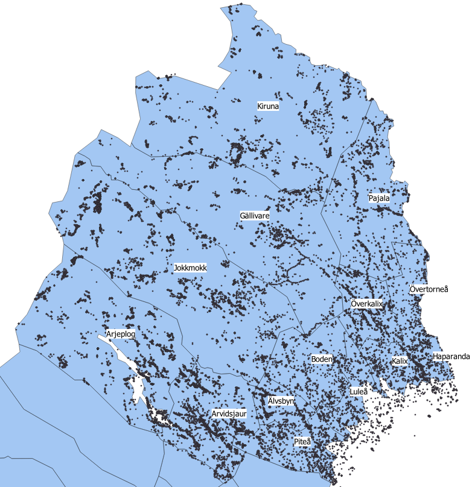{width="3.8675010936132983in"
height="3.996247812773403in"}

*Figur 9.1 Fornlämningar samt Norrbottens kommunytor etiketterade.*

### 9.3 Räkna punkter i polygon {#räkna-punkter-i-polygon .unnumbered}

I *Geobearbetning verktygslåda* finns verktyget *Räkna punkter i
polygon.* Algoritmen kan köras efter att ha pekat ut punkt- respektive
polygonlager samt namngett ett attribut för att hålla värdet av antalet
punkter i ytan. Ett nytt polygonlager läggs till som har ett attribut
*Antal* ifrån algoritmens resultat. Efter att ha kopierat över
symbolsättningen av Sveriges kommuner på det nya lagret samt gjort det
nya lagret permanent, kan det ursprungliga lagret med Sveriges kommuner
tas bort. I det nya polygonlagret filtreras Norrbottens kommuner ut.
Därefter ser kartvyn i QGIS-projektet ut som i Figur 9.2 nedan.
Attributtabellen för det nya polygonlagret ser ut som i Figur 9.3.

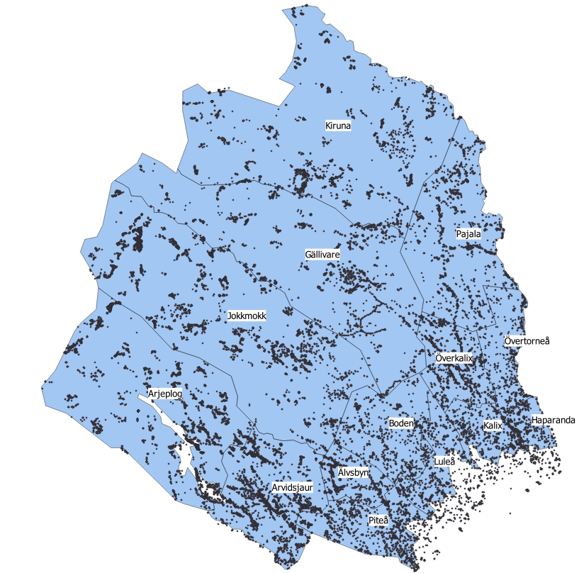{width="4.40670384951881in"
height="4.358127734033246in"}

*Figur 9.2 Fornlämningar samt enbart Norrbottens kommunytor i lagret som
har attributet för antal lämningar per kommun.*

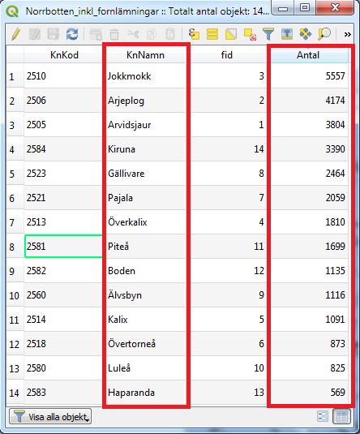{width="3.2471237970253717in"
height="3.9119510061242346in"}

*Figur 9.3 Attributtabellen för polygonlagret i Figur 9.2. Kolumnerna
KnNamn samt Antal är de intressanta.*

## Övning -- csv hantering

### 10.1 Inledning {#inledning-6 .unnumbered}

Det finns mängder av data som har en implicit geografisk koppling och de
är därmed även per definition geodata. I övningen använder vi kommunytor
från Lantmäteriet och kopplar statistik ifrån SCB till dessa ytor.
Kopplingen mellan ytorna och statistiken görs med kommunkoden.

Indata:

-   *Kommun_Sweref99TM_region.shp* och

-   csv-fil från SCB:s statistikdatabas: surfa till SCB:s
    statistikdatabas
    ([http://www.statistikdatabasen.scb.se](http://www.statistikdatabasen.scb.se/)).
    Välj *BefolkningBefolkningsstatistikFolkmängd Folkmängden efter
    region, civilstånd, ålder och kön. År 1968 -- 2018.* I gränssnittet,
    gör val enligt Figur 10.1 nedan. För variabeln år: välj 2018, 2008
    och 1968. Välj formatet "Kommaavgränsad med rubrik". Tryck på
    knappen *Fortsätt* och csv-filen laddas ned automatiskt. Leta upp
    filen, passa på att flytta den till en annan mapp samt döp om den,
    t.ex. till Befolkning_tre_år.csv. Öppna den gärna i din
    favorit-textredigerare och bekanta dig med innehållet.

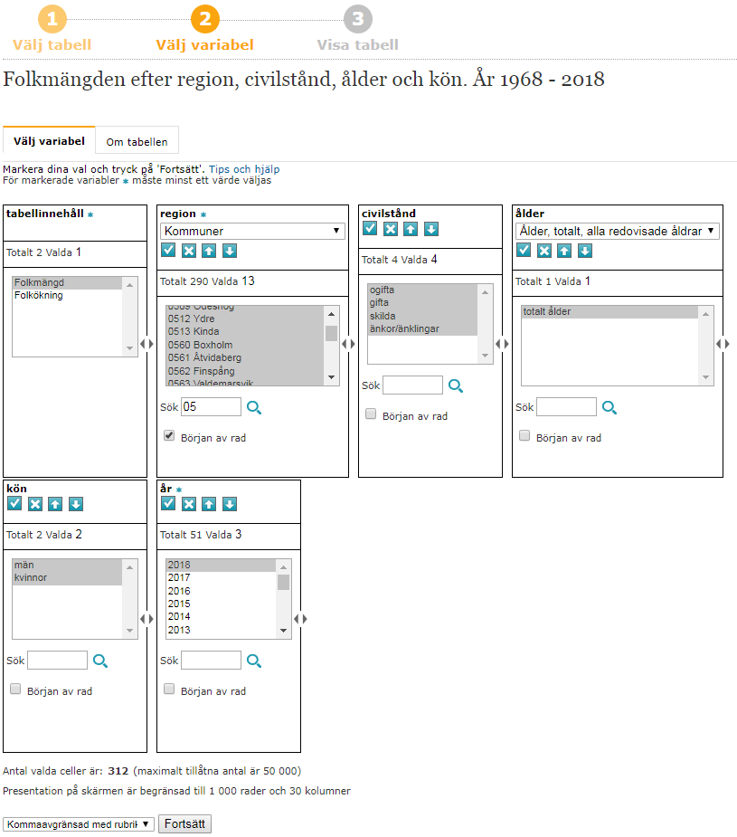{width="4.773044619422572in"
height="5.417027559055118in"}

*Figur 10.1 Nedladdning av statistikdata från SCB.*

Starta QGIS och välj Nytt projekt, ifall du inte redan har programmet
öppet med ett blankt projekt.

### 10.2 Lagerhantering, importera csv-fil {#lagerhantering-importera-csv-fil .unnumbered}

Lägg till lagret *Kommun_Sweref99TM_region.shp* i ett tomt projekt och
döp om det till Kommuner. Öppna dess attributtabell och se efter ifall
de svenska tecknen skrivs ut korrekt. Ser det fel ut, åtgärda genom att
stänga attributtabellen och ändra *Datakällans kodning* till Latin9 i
lageregenskaperna, fliken *Källa*. Stäng lageregenskaperna alternativt
stäng attributtabellen ifall de svenska tecknen tolkades korrekt.

Tryck därefter på knappen *Lägg till separerad text-lager*
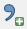{width="0.20360126859142608in"
height="0.2186832895888014in"} i verktygsfältet datakällor. Dialogrutan
*Datakällor\|Separerad text* öppnas. Peka ut den nedladdade csv-filen
från SCB högst upp i rutan vid inställningen för *Filnamn*. Innehållet i
filen kommer upp i förhandsgranskningen inne i dialogrutan. Behöver du
ändra teckenkodningen (ifall de svenska tecken inte visas korrekt), sätt
*Kodning* till Latin9. Kontrollera därefter att filformatet är satt till
CSV (kommaseparerade värden).

Som du märker i förhandsgranskningen och/eller i en textredigerare,
startar csv-filen med tabellens namn såsom den benämns i SCB:s
statistikdatabas. Rubrikerna, som vi ju valde innan nedladdningen att ha
med i csv-filen, startar därunder. Bocka därför i rutan *Första raden
innehåller fältnamn* och sätt *Antal inledande rader att hoppa över*
till 1. Förhandsvisningen uppdateras och nu hamnar rubrikerna som
attributnamn och värdena som rader.

Expandera inställningsgruppen *Geometridefinition*. Hade vi haft
kolumner för x och y värden i csv-filen, är det här vi hade pekat ut
dessa. Markera därför valknappen *Ingen geometri (endast
attributtabell)*. Figur 10.2 nedan visar inställningar och
förhandsvisning av csv-filen. Tryck därefter på knappen *Lägg till* samt
slutligen knappen *Close*.

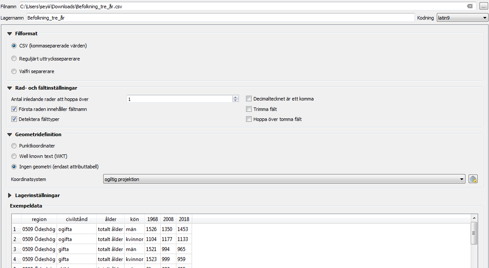{width="5.309656605424322in"
height="2.912351268591426in"}

*Figur 10.2 Lägg till csv-fil som lager i QGIS.*

### 10.3 Sammanslagning av vektorlager {#sammanslagning-av-vektorlager .unnumbered}

För att koppla statistik i csv-lagret till kommunytorna gör vi en s.k.
*sammanslagning*. Öppna egenskaperna för lagret *Kommuner* och välj
fliken *sammanslagningar*. Tryck på *Skapa ny sammanslagning*
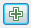{width="0.2338921697287839in"
height="0.21125765529308838in"} och dialogrutan *Lägg till ihopslagning
av vektor* öppnas.

Kontrollera att inställningen *Lager att slå ihop med* är satt till ditt
csv-lager. Välj därefter *Fält* (attribut) i respektive lager för att
göra kopplingen. *Fält för sammanslagning* ska vara region (från
csv-lagret) och *Målfält* ska vara *KnNamn* (från lagret med
kommunytor).

Bocka i rutan *Eget fältnamnsprefix* och radera det automatgenererade
prefixet. Ett prefix är bra ifall attributen heter likadant i de lager
som ingår i sammanslagningen. Oftast blir dock det automatgenererade
prefixet för klumpigt, varför vi i denna inställning ges valet att
själva välja prefix. I vårt fall finns det ingen risk till förväxling av
attributen och vi behöver således inget prefix.

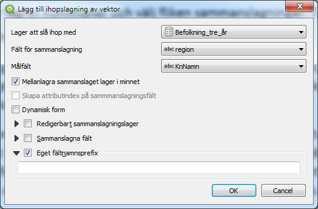{width="3.592263779527559in"
height="2.364963910761155in"}

*Figur 10.3 Inställningar för ihopslagning av kommunytor och statistik.*

Efter kontroll av inställningarna mot Figur 10.3 ovan, tryck OK i bägge
dialogrutorna och öppna därefter attributtabellen för kommunytorna.
Attributen har lagts till ifrån csv-lagret, jfr Figur 10.4 nedan, men
alla värdena för dessa attribut är *NULL*!

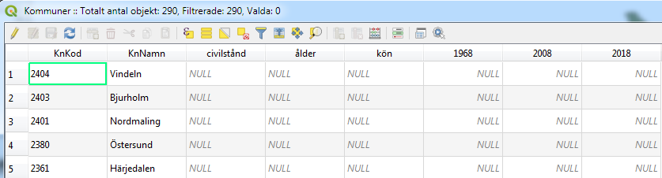{width="6.3in"
height="1.7013888888888888in"}

*Figur 10.4 Attributtabellen för lagret Kommuner efter sammanslagningen
med csv-lagret.*

Tittar vi närmre på de bägge kopplingsattributen, märker vi att
attributet *region* i csv-lagret innehåller både kommunkod och
kommunnamn. Öppna egenskaperna för kommunlagret och ta bort den
felaktiga sammanslagningen i fliken sammanslagningar. Markera
sammanslagningen, tryck på *Ta bort vald sammanslagning*
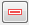{width="0.19847112860892388in"
height="0.17109689413823273in"} och tryck därefter på knappen *OK* för
att stänga lageregenskaperna.

Vi vill nu åtgärda problemet med attributet *region* i csv-lagret.
Kommunnamnet finns redan i lagret med kommunytor, därför behöver vi inte
dela upp attributet region i två, utan det räcker med att ta bort delen
med kommunnamnet i attributet och använda oss av kommunkoden för
sammanslagningen. Det är generellt ändå en god idé att göra
sammanslagningar baserat på numeriska värden istället för textsträngar
(m a p eventuella teckenkodningsproblem). Nästa avsnitt kommer att
handla om att redigera lager, men det är inte tillämpbart här eftersom
csv-lager är ej redigeringsbara lager i QGIS. En möjlig lösning är att
spara lagret i ett annat format, göra förändringar och därefter åter
spara som csv. En annan lösning är att manuellt redigera csv-filen med
sök och ersätta metodik i en textredigerare. Ytterligare en lösning vi
ska använda oss av här är att nyttja ett s.k. virtuellt lager i QGIS.

Innan vi går in på virtuella lager, behöver vi först modifiera
rubrikerna med årtal i csv-filen då de annars kan ställa till problem i
samband med virtuella lager. Ta först bort csv-lagret i QGIS-projektet
genom att i lagerlistan högerklicka på lagernamnet*Ta bort lager*.

Öppna csv-filen i en textredigerare och sätt prefixet Y för de tre
rubrikerna med årtal, d.v.s. "1968" ändras till "Y1968" osv. Denna
process gör oss även lite mera bekanta med grunddatat och leder troligen
till att vi gör en mer grundlig inspektion av indata nästa gång. Spara
över befintlig fil eller välj att spara med ett annat filnamn. Lägg till
den modifierade csv-filen enligt tidigare tillvägagångssätt och notera
att inställningarna bör vara kvar i dialogrutan för att lägga till
separerad text-lager.

Då csv-lagret är tillagt, spara projektet på lämpligt ställe.

### 10.4 Skapa virtuellt lager i QGIS {#skapa-virtuellt-lager-i-qgis .unnumbered}

Ett virtuellt lager i QGIS är en speciell form av vektorlager som
definieras genom en s.k. *SQL*-fråga till ett eller flera andra lager.
SQL (*Structured Query Language*), är ett språk för att ställa frågor
till en databas. Virtuella lager är baserade på SQlite/SpatiaLite (jfr
avsnitt 5.3), vilket gör att SQL för dessa går att använda för att
definiera lagret. Ett virtuellt lager håller inga egna data utan är
beroende av andra lager för att få sitt innehåll. De går att jämföra med
vyer i en databas.

Lägg till ett virtuellt lager genom att i menynraden välja *Lager Lägg
till lager Lägg till/Redigera virtuellt lager*. Fönstret *Datakällor \|
Virtuellt lager* öppnas. Klistra in nedan SQL i rutan *Fråga*:

SELECT substr(region, 1, 4) AS Kommunkod, SUM(Y1968) AS Total_1968,
SUM(Y2008) AS Total_2008, SUM(Y2018) AS Total_2018

FROM Befolkning_tre_år

GROUP BY substr(region, 1, 4)

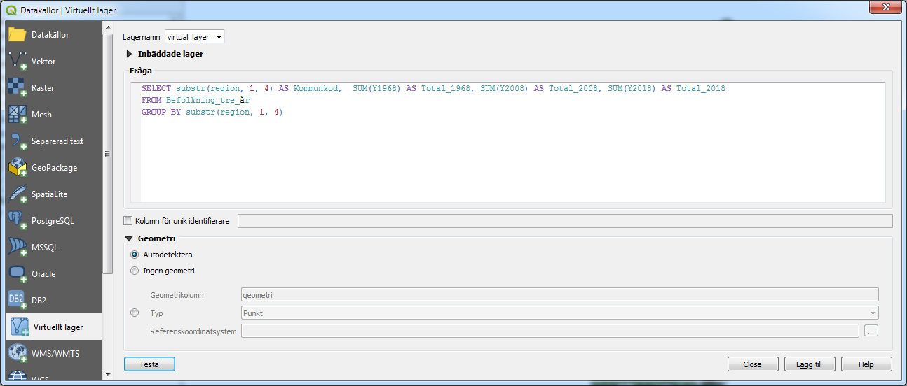{width="6.3in" height="2.6875in"}

*Figur 10.5 Skapa virtuellt lager.*

I korthet resulterar ovan SQL i att det virtuella lagret kommer att ha
ett attribut *Kommunkod*, vilket enbart kommer att innehålla kommunkoden
ifrån attributet *region* i csv-lagret. Vidare får vi en rad per kommun,
med summering av befolkningen för de olika civilstånden. Lämna övriga
inställningar orörda, jfr med Figur 10.5 ovan, och tryck *Lägg till*
samt därefter *Close*. Öppna därefter attributtabellen för lagret
*virtual_layer*, jfr. Figur 10.6 nedan. I tabellen ser vi att det finns
en rad per kommun och varje rad innehåller attributvärden för kommunkod
samt total befolkningsmängd för de tre olika åren. Stäng
attributtabellen.

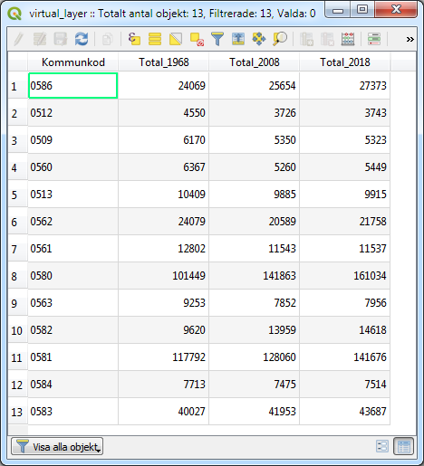{width="3.1023578302712163in"
height="3.4139195100612425in"}

*10.6 Attributtabellen för det skapade virtuella lagret.*

### 10.5 Exportera urval {#exportera-urval .unnumbered}

Klicka på lagret Kommuner i lagerlistan och därefter knappen *Välj
objekt med värde*
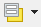{width="0.3208530183727034in"
height="0.21129265091863517in"} i verktygsfältet. Skriv 05 i fältet för
*KnKod* samt ändra urvalskriteriet till *Börjar med* för detta fält.
Klicka därefter på knappen *Välj objekt* och notera att urvalet,
kommunerna i Östergötland, får en selekteringsfärg i kartvyn. Jämför med
Figur 10.7 nedan och stäng därefter dialogrutan.

{width="2.8154811898512686in"
height="2.438148512685914in"}

*10.7 Urval av Östergötlands kommuner.*

Högerklicka på lagret *Kommuner Exportera Spara valda objekt som*. Välj
GeoPackage som filformat, ge filen namnet *Östergötland* och leta upp
lämplig mapp att spara filen i. Kontrollera att valet *Lägg till sparad
fil i kartan* är ibockad. Tryck därefter på knappen *OK* och det sparade
urvalet kommer att läggas till i projektet som ett eget lager. Spara
projektet.

### 10.6 Ny sammanslagning {#ny-sammanslagning .unnumbered}

Nu kan vi göra om sammanslagningen enligt stegen ovan, men med lagren
*Östergötland* och det virtuella lagret istället. Öppna
lageregenskaperna för lagret *Östergötland*, välj fliken
sammanslagningar och tryck på plus-ikonen. *Lager att slå ihop med*
sätts till virtual_layer och *Fält för sammanslagning* ska vara
*Kommunkod.* *Målfältet*, alltså fältet att slå ihop utifrån i lagret
*Östergötland*, ska vara *KnKod*. Glöm inte att ta bort
fältnamnsprefixet och tryck *OK* i bägge dialogrutorna.

Öppna attributtabellen för lagret *Östergötland*. Attributen ifrån det
virtuella lagret är där tillsammans med värden. Testa att trycka t.ex.
på attributnamnet *Total_2018* två gånger för att sortera i fallande
ordning utefter denna kolumn. Notera symbolen med en penna längst uppe
till vänster i attributtabellen (förklaring kommer i ett kommande
avsnitt) och stäng därefter attributtabellen.

### 10.7 Redigera lager {#redigera-lager .unnumbered}

För att redigera ett lager i QGIS, högerklicka på lagret*Växla
redigeringsläge*. Lagret är nu aktivt för redigering av både geometri
och attribut, vilket markeras i lagerlistan med en pennsymbol, se Figur
10.8 nedan.

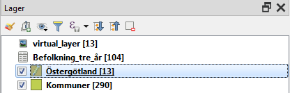{width="4.333333333333333in"
height="1.3958333333333333in"}

*Figur 10.8 Lagret Östergötland är här aktivt för redigering.*

Öppna attributtabellen för lagret *Östergötland* och notera att
redigeringsläget är aktivt, vilket den intryckta pennsymbolen längst
uppe till vänster indikerar.

Det vore intressant att se hur befolkningstillväxten i kommunerna varit
de senaste 50 respektive 10 åren. Vi börjar med att skapa ett attribut
för förändringen mellan åren 1968 och 2018. Tryck på knappen
*Fältkalkylator*
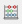{width="0.1683464566929134in"
height="0.18365157480314961in"} och ett nytt fönster, *Fältkalkylator*,
öppnas.

Lämna rutan *Skapa nytt fält* ibockad och skriv *Ökning_50* som
*Fältnamn*. Notera att det finns ett val för att *Skapa virtuellt fält*,
vilket är användbart när det inte är önskvärt att fältet sparas i
datakällan utan enbart inom projektet. Här vill vi dock ha fältet sparat
i datakällan.

*Fälttypen* ska vara *Decimaltal (real)* och för precision vill vi ha
två decimaler, ifall det går att ändra på. Oavsett om precision går att
ändra på eller inte, tar vi höjd för det i uttrycket nedan som avrundar
procenttalen till två decimaler. Uttrycket skriver vi likt tidigare med
dubbla citattecken om fältnamnen. Beräkningen av förändringen blir
befolkningen år 2018 minskat med befolkningen 1968, dividerat med
befolkningen 1968. Detta multiplicerar vi med 100 för att få procenttal
och slutligen avrundar vi till 2 decimaler. Vårt uttryck blir därmed:

round( 100 \* ( \"Total_2018\" - \"Total_1968\" ) / \"Total_1968\", 2 )

Skriv in detta i den vänstra rutan, jfr Figur 10.9 nedan, och tryck
därefter på knappen *OK*. Gör om stegen ovan för ökningen mellan åren
2008 och 2018. Skriv *Ökning_10* för fältnamnet och ändra *Total_1968*
till *Total_2008* i uttrycket.

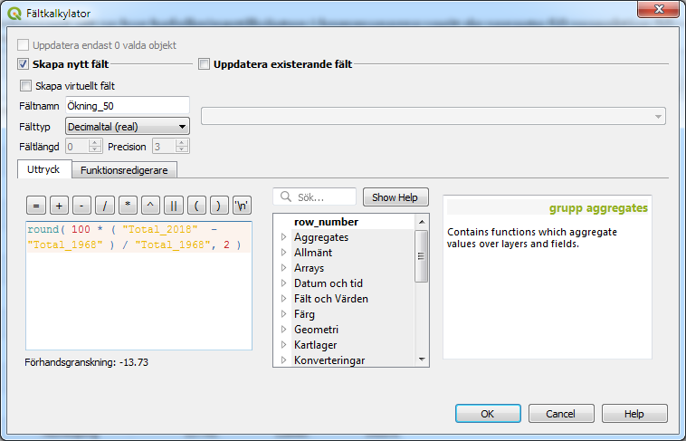{width="5.050170603674541in"
height="3.2448687664041995in"}

*Figur 10.9 Skapa nytt fält med uttryck för befolkningsökningen mellan
åren 1968 och 2018.*

När de två nya attributen är skapade, tryck på pennsymbolen (i
attributtabellen eller i lagerlistan) samt *OK* för att bekräfta att du
vill spara förändringarna i lagret. Attributtabellen ser nu ut som Figur
10.10 nedan och vi börjar bli färdiga för att fundera över hur vi kan
visualisera vår data med en s.k. *utskriftslayout*. Innan dess vill vi
dock bearbeta data m h a en rad verktyg.

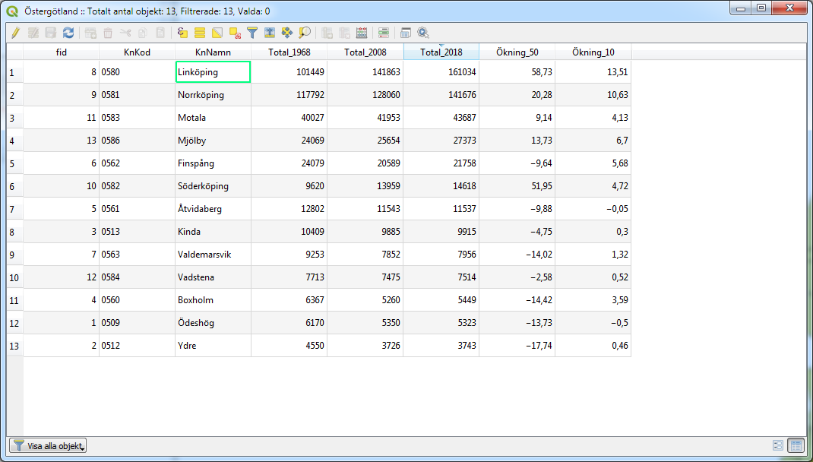{width="4.69701334208224in"
height="2.668992782152231in"}

*Figur 10.10 Attributtabellen för lagret Östergötland efter att
attributen för befolkningsökningar lagts till.*

### 10.8 Geobehandlingsverktyg: Lös upp {#geobehandlingsverktyg-lös-upp .unnumbered}

För att inte Östergötland ska vara helt isolerat ifrån övriga Sverige i
vår visualisering, men heller inte drunkna i hela Sverige, vill vi ta
med en del ifrån lagret *Kommuner*. Vi börjar med att använda verktyget
*Lös upp* för att skapa en enda polygon av Östergötlands kommuner. Välj
*Vektor Geobehandlingsverktyg Lös upp* och ett nytt fönster, *Lös upp,*
öppnas (jfr Figur 10.11 nedan). Kontrollera att indatalager är
*Östergötland*, lämna i övrigt inställningarna som de är och tryck
*Kör*.

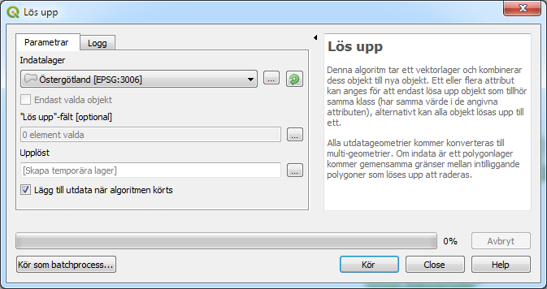{width="3.573432852143482in"
height="1.890310586176728in"}

*Figur 10.11 Inställningar för geobehandlingsverktyget Lös upp.*

Tryck på knappen *Close* när algoritmen är färdig och vi har nu ett nytt
lager, *Upplöst*, i lagerlistan. Kontrollera att antalet polygoner i
detta lager är 1, genom att visa antal objekt för lagret. Jämför kartvyn
mot figur 10.12 nedan genom att visa respektive dölja de olika lagren.

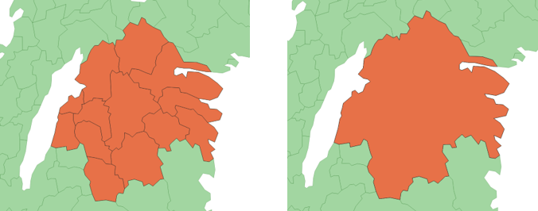{width="5.170252624671916in"
height="2.034589895013123in"}

*Figur 10.12 Till vänster Östergötlands kommuner och till höger det
upplösta lagret.*

### 10.9 Geobehandlingsverktyg: Buffert {#geobehandlingsverktyg-buffert .unnumbered}

Därefter skapar vi en buffert kring det upplösta resultatet genom att
välja *Vektor Geobehandlingsverktyg Buffert*. Sätt *Indatalager* till
*Upplöst* och ändra *Avstånd* till 43 kilometer.

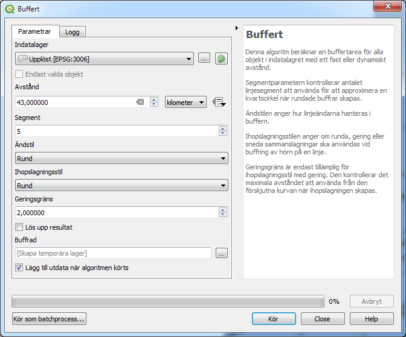{width="3.8240748031496063in"
height="3.1812521872265966in"}

*Figur 10.13 Inställningar för geobehandlingsverktyget Buffert.*

Jämför inställningarna med Figur 10.13 ovan, tryck på knappen *Kör* och
därefter *Close*. Ifall du har tid, kör verktyget några gånger och testa
olika buffertavstånd eller ändra övriga inställningar. De resulterande
lagren är temporära lager, vilket gör det smidigt att fort kasta bort
oönskade resultat.

Anledningen till att buffertzonen sattes till 43 kilometer, framgår av
Figur 10.14 nedan. Inkluderat i buffertzonen finns bl.a. Vättern, vilket
gör det lättare att lokalisera Östergötland i Sverige.

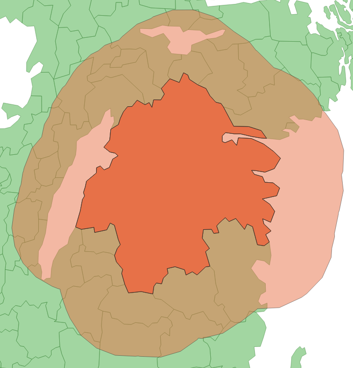{width="1.9054822834645668in"
height="1.987607174103237in"}

*Figur 10.14 Buffertzon kring det upplösta lagret med Östergötlands
kommuner.*

### 10.10 Geobehandlingsverktyg: Differens {#geobehandlingsverktyg-differens .unnumbered}

För att enbart behålla själva bufferten använder vi verktyget
*Differens*. Lagret *Buffrad* inkluderar nämligen även Östergötlands
yta. Att enbart ha kvar buffertzonen kan underlätta vid senare
lagerhantering. Dessutom undviker vi att dra med oss onödigt stora
datamängder. Verktyget differens jämför två lager och behåller delen som
enbart finns i ena lagret (indatalagret nedan).

Öppna verktyget via *Vektor Geobehandlingsverktyg Differens*. Sätt
*Indatalager* till *Buffrad* och *Överlagringslager* till
*Östergötland*, jfr Figur 10.15 nedan. Tryck därefter *Kör* och på
knappen *Close* när algoritmen är klar. Ett nytt lager, *Differens*,
läggs till i lagerlistan. Lagret ser ut likt Figur 10.16 nedan.

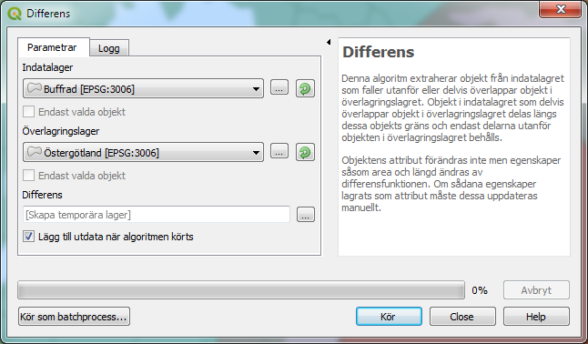{width="4.558038057742782in"
height="2.666894138232721in"}

*Figur 10.15 Inställningar för geobehandlingsverktyget Differens.*

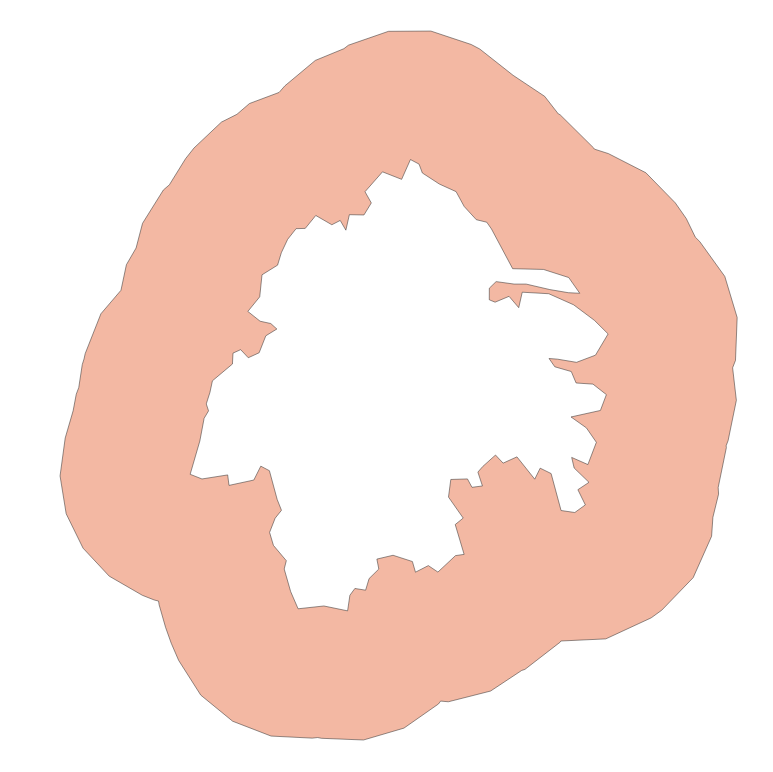{width="2.045031714785652in"
height="2.0423261154855643in"}

*Figur 10.16 Lagret Differens, vilket enbart innehåller själva
buffertzonen.*

### 10.11 Geobehandlingsverktyg: Klipp {#geobehandlingsverktyg-klipp .unnumbered}

Slutligen använder vi oss även av verktyget *Klipp* för att klippa ut
lagret med alla Sveriges kommuner mot vår buffertzon (lagret
*Differens*). I menyraden, välj *Vektor Geobehandlingsverktyg Klipp*.
Vårt *Indatalager* ("pepparkaksdegen", jfr avsnitt 4.3) är *Kommuner*
och *Överlagringslager* är vår buffertzon, lagret *Differens*. Jämför
inställningarna med Figur 10.17 nedan, tryck *Kör* och därefter på
knappen *Close* då algoritmen kört färdigt.

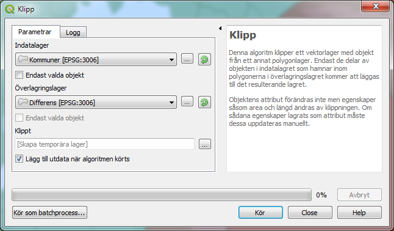{width="4.6844083552055995in"
height="2.7408333333333332in"}

*Figur 10.17 Inställningar för geobehandlingsverktyget Klipp.*

I lagerlistan har vi nu lagret *Klippt.* Detta består av klippta ytor
från lagret med Sveriges kommuner som faller inom själva buffertzonen
kring Östergötland. Se Figur 10.18 nedan.

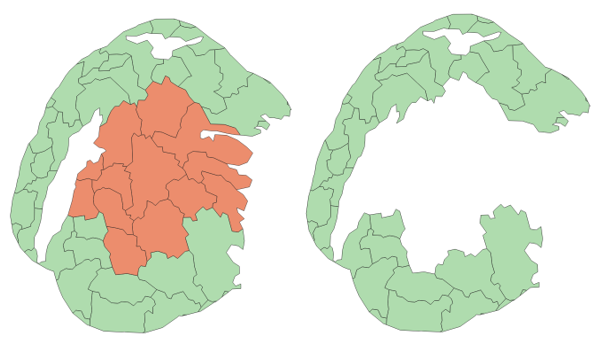{width="4.255199037620297in"
height="2.4456791338582677in"}

*Figur 10.18 Till vänster lagren Östergötland och Klippt. Till höger
enbart lagret Klippt.*

Högerklicka på lagret *Klippt Gör permanent*. Skillnaden mellan detta
och att exportera data på vanligt vis är att det inte skapas något nytt
lager utan det sparade lagret ersätter automatiskt det temporära lagret.
Rensa i lagerlistan genom att ta bort lagren *Kommuner*, *Buffrad*,
*Differens* samt *Upplöst* från lagerlistan. Döp om lagret *Klippt* till
*Omgivande_kommuner.*

OBS, spara projektet nu! Efter att projektet är sparat, gå till
menyraden *Projekt Spara som* och ge det samma namn som det tidigare
projektet men avsluta namnet med valfritt suffix, t.ex *Övning_csv_2*.
Anledningen till denna manöver är att vi kommer att arbeta vidare utan
sammanslagningen och det virtuella lagret. För att kunna återvända till
läget med sammanslagningen, behöver vi spara undan projektet.

Ta bort lagret *virtual_layer* och öppna attributtabellen för lagret
*Östergötland*. Eftersom det virtuella lagret är borttaget, är även
sammanslagningen borta. Därmed är även de attribut i lagret
*Östergötland* som hade ursprung i sammanslagningen borta. Dock finns
attributen och värdena för befolkningsökningarna kvar och det är enbart
dessa vi vill ha kvar framöver. Till sist, ta även bort csv-lagret och
spara projektet.

I syfte att förbereda lagren för en layout, som vi kommer att skapa i
kapitel 11, går vi nu in på symbolsättning och etikettering.

### 10.12 Symbologi {#symbologi-1 .unnumbered}

Öppna lageregenskaperna för lagret *Omgivande_kommuner,* fliken
*Symbologi*. Välj *Enkel fyllning* och ge lagret en kombination av grå
färg och opacitet, i syfte att göra det mera diskret. Figur 10.19 visa
en möjlig symbolsättning. Klicka på knappen *Apply* för att se
resultatet direkt i kartvyn och därefter *OK* när du är nöjd.

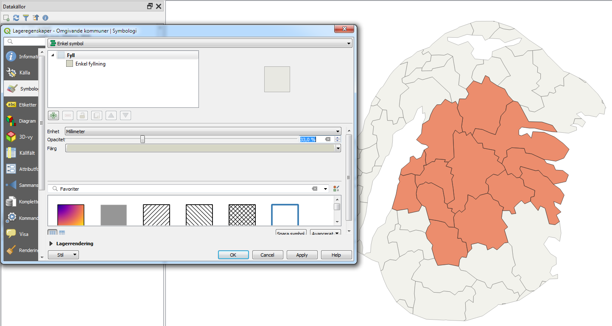{width="4.789688320209974in"
height="2.559040901137358in"}

*Figur 10.19 Symbolsättning av lagret med de omgivande kommunerna.*

Lagret *Östergötland* symbolsätter vi utifrån befolkningsökningen mellan
åren 1968 och 2018, d.v.s. utefter attributet *Ökning_50*. Öppna
lageregenskaperna för lagret, fliken *Symbologi*. Välj *Intervall* och
välj *Ökning_50* för inställningen *Kolumn.* Klicka på pilen vid
inställningen *Färggradient.* Det går att välja bland befintliga
färggradienter, men också att skapa nya utifrån olika kataloger. Välj
*Skapa* *Ny Färggradient* samt därefter *Katalog: ColorBrewer* i
rullistan i den nya rutan. Tryck *OK* och ytterligare en ruta,
*ColorBrewer: Gradient,* öppnas. Välj t.ex. *Blues* i inställningen för
schemanamn och sätt antalet färger till tre, jfr Figur 10.20 nedan, och
tryck därefter *OK*.

{width="2.705641951006124in"
height="1.97166447944007in"}

*Figur 10.20 Ny färggradient ifrån ColorBrewer katalogen.*

Fortsätt med inställningar i symbologi-fliken och jämför med Figur 10.21
nedan. Sätt inställningen *Läge* till *Pretty Breaks* och *Klasser* till
6. Tryck på knappen *Klassificera* och *Apply* för att testa
symbolsättningen; fortsätt att jämföra mot Figur 10.21 nedan. Klicka
*OK* när du är nöjd.

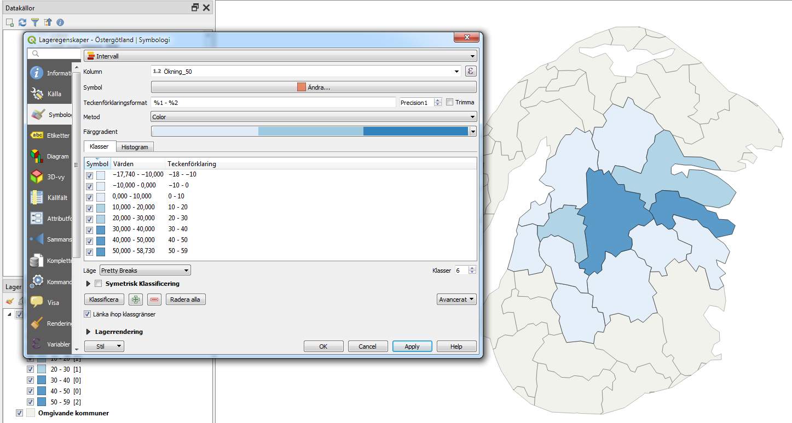{width="5.393910761154856in"
height="2.8854319772528436in"}

*Figur 10.21 Symbolsättning av lagret med Östergötlands kommuner.*

### 10.13 Etiketter {#etiketter-1 .unnumbered}

För att verkligen nyttja kartan som informationsbärare, vill vi att den
fort går att tolka. Ett bra sätt är att skriva ut förklarande text eller
attributvärden direkt vid objekten i kartan. Detta gör vi m h a
etiketter.

Öppna lageregenskaperna för lagret *Östergötland* och välj fliken
*Etiketter*. Välj *Enkla etiketter* högst upp. För inställningen
*Etikettera med,* tryck på knappen
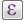{width="0.17505686789151356in"
height="0.15222331583552057in"} till höger för att komma till rutan
*Uttrycksdialog.* Skriv in uttrycket:

\"KnNamn\" \|\| \'\\n\' \|\|round( \"Ökning_50\",0) \|\| \'\\n\'
\|\|round( \"Ökning_10\",0)

Detta kryptiska uttryck ska tolkas som att en etikett skrivs ut med:
kommunnamnet på första raden, ny rad, attributet *Ökning_50* avrundat
till heltal, ny rad samt slutligen attributet *Ökning_10* avrundat till
heltal. Jämför Figur 10.21 nedan och observera att det finns en
förhandsgranskning nere till vänster som hjälp. Tryck därefter *OK* samt
*Apply* i fliken etiketter för lageregenskaperna.

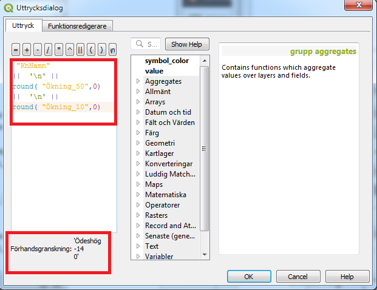{width="3.5274529746281713in"
height="2.6875831146106735in"}

*Figur 10.21 Fönstret Uttrycksdialog. Skapa etikett utifrån uttryck.*

#### I kartvyn ser vi nu att etiketterna skrivs ut. För att de ska se bättre ut, finns en rad val i understa sektionen av fliken etiketter. Välj kategorin Text och sätt Storlek till 12 punkter. Bocka i rutan Rita ut bakgrund i kategorin Bakgrund och dra ned opaciteten i samma kategori till 50%. Sätt även Linjefärg till svart med tjocklek 0,5 för bakgrunden. Jämför inställningarna med Figur 10.22 nedan. {#i-kartvyn-ser-vi-nu-att-etiketterna-skrivs-ut.-för-att-de-ska-se-bättre-ut-finns-en-rad-val-i-understa-sektionen-av-fliken-etiketter.-välj-kategorin-text-och-sätt-storlek-till-12-punkter.-bocka-i-rutan-rita-ut-bakgrund-i-kategorin-bakgrund-och-dra-ned-opaciteten-i-samma-kategori-till-50.-sätt-även-linjefärg-till-svart-med-tjocklek-05-för-bakgrunden.-jämför-inställningarna-med-figur-10.22-nedan. .unnumbered}

#### 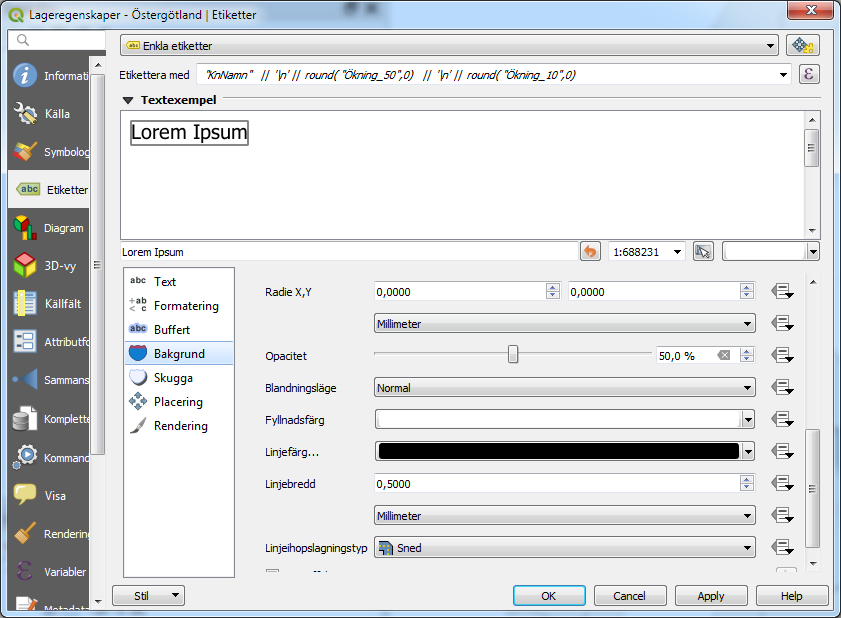{width="5.0545745844269465in" height="3.714041994750656in"} {#section-1 .unnumbered}

*Figur 10.22 Inställningar för etiketter.*

#### Tryck Apply för att se resultatet i kartvyn. När du är nöjd, tryck på knappen OK. Passa på att dra ned opaciteten för det omgivande kommunlagret ytterligare och kartvyn bör se ut ungefär som i Figur 10.23 nedan. {#tryck-apply-för-att-se-resultatet-i-kartvyn.-när-du-är-nöjd-tryck-på-knappen-ok.-passa-på-att-dra-ned-opaciteten-för-det-omgivande-kommunlagret-ytterligare-och-kartvyn-bör-se-ut-ungefär-som-i-figur-10.23-nedan. .unnumbered}

{width="3.228649387576553in"
height="3.5621205161854768in"}

*Figur 10.23 Etiketter i kartvyn för lagret Östergötland.*

## Övning -- utskriftslayout

### 11.1 Inledning {#inledning-7 .unnumbered}

I denna övning kommer vi att skapa en layout för projektet i kapitel 10.
Öppna därför det sist sparade projektet från föregående övning.

Indata:

-   ingen, utom det sist sparade projektet ifrån övningen i kapitel 10.

### 11.2 Allmänt om layout och mallar {#allmänt-om-layout-och-mallar .unnumbered}

Det går att koppla en eller flera layouts till samma projekt i QGIS. Det
går vidare att spara hela eller delar av en layout som en mall, vilket
underlättar arbetet med att ta fram en layout för ett nytt projekt.

### 11.3 Ny utskriftslayout {#ny-utskriftslayout .unnumbered}

Gå till menyn *Projekt* *Ny utskriftslayout* och ge layouten valfri
titel (jfr Figur 11.1).

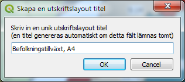{width="3.2916666666666665in"
height="1.46875in"}

*Figur 11.1 Titel för utskriftslayouten.*

En tom utskriftslayout öppnas i ett nytt fönster, vars namn är den titel
du nyss angav.

### 11.4 Gränssnittet i layoutfönstret {#gränssnittet-i-layoutfönstret .unnumbered}

Centralt i det nya fönstret som öppnas är en tom yta, där det går att
placera olika *element*. Den tomma ytan motsvarar som standard en ett
liggande papper i A4-format. Jämför med Figur 11.2 nedan, där det lagts
till ett kartelement.

Varje element har tillhörande *elementegenskaper,* vilka syns i panelen
med samma namn till höger i gränssnittet. Längs vänstra sidan i
gränssnittet finns verktygsfältet *Verktygslåda*, varifrån du kommer åt
att lägga till olika element till utskriftslayouten.

### 11.5 Lägg till karta {#lägg-till-karta .unnumbered}

Klicka på knappen Lägg till karta
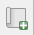{width="0.20712379702537184in"
height="0.21321522309711285in"}. Klicka därefter i den tomma ytan och
dra en rektangel där du vill ha din karta. Utskriftslayouten bör nu se
ut likt nedan Figur 11.2.

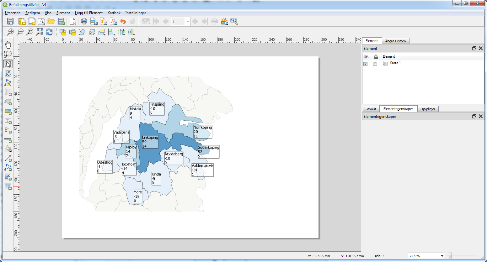{width="5.801208442694663in"
height="3.125055774278215in"}

*Figur 11.2 Utskriftslayout med kartelement.*

Selektera därefter kartan med knappen *Välj/Flytta element*
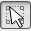{width="0.21875in" height="0.21875in"}.
Till höger i panelen *element-egenskaper* kommer du nu åt de specifika
egenskaperna för kartelementet, jfr Figur 11.3 nedan. Detta element
relaterar till kartvyn i QGIS huvudfönster, men visningen i layouten
uppdateras inte automatiskt. Det går att skriva in en skala för
kartelementet i layouten. Mera användbart är det oftast att använda
knappen *Sätt till kartbladets utsträckning,* som synkroniserar vyerna
på så sätt att aktuellt visningsläge från huvudfönstrets kartvy kopieras
över till layoutens vy. Det enklaste sättet att greppa innebörden av
knappen är att testa att panorera eller zooma i huvudfönstrets kartvy
och därefter trycka på knappen.

Knappen *Visa utbredning i kartfönster* fungerar som knappen *Sätt till
kartbladets utsträckning,* fast omvänt. Återigen är det läge att testa
även denna knapp, för att förstå hur den fungerar. Rumsliga bokmärken,
vilka behandlades i avsnitt 3.3, är bra att använda i samband med
layouts.

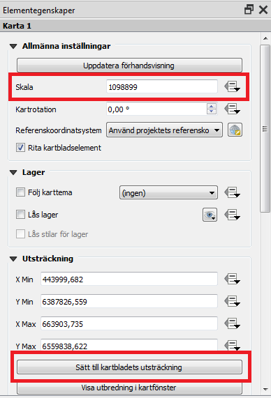{width="2.2521741032370954in"
height="3.312703412073491in"}

*Figur 11.3 Kartelementets egenskaper.*

### 11.6 Teckenförklaring {#teckenförklaring .unnumbered}

Lägg till en teckenförklaring genom att klicka på knappen
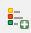{width="0.21501859142607174in"
height="0.22889107611548556in"} och därefter klicka och dra en rektangel
i den centrala ytan. Alla lager som finns i lagerlistan kommer med i
teckenförklaringen, vilket ofta inte är önskvärt. Välj
teckenförklaringen med *Välj/flytta element* och i fliken
*Objektegenskaper* bocka ur *uppdatera automatiskt*. Markera lagret
*Omgivande_kommuner* och tryck på knappen
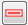{width="0.17958114610673664in"
height="0.16034011373578302in"}. Detta lager vill vi inte ha med i
teckenförklaringen.

Intervallerna för lagret *Östergötland* ligger i stigande ordning, från
-18 till 59. Ändra detta till att de hamnar i fallande ordning istället,
för att underlätta tolkningen. Markera respektive intervall och flytta
upp eller ner med knapparna
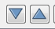{width="0.4406146106736658in"
height="0.23289588801399824in"} .

### 11.7 Lägg till rubrik {#lägg-till-rubrik .unnumbered}

Lägg till en rubrik genom att trycka på knappen *Ny etikett*
{width="0.215249343832021in"
height="0.2013626421697288in"} och därefter klicka och dra en rektangel.
I elementegenskaperna för etiketten (rubriken) finns en rad olika
inställningar för typsnitt etc. Ge layouten en lämplig rubrik och stil.

### 11.8 Norr-pil och skalstock {#norr-pil-och-skalstock .unnumbered}

För att lägga till en norr-pil, tryck på knappen *Lägger till en ny
Pil...* 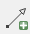{width="0.20734251968503936in"
height="0.2349879702537183in"} i *Verktygslådan* till vänster.
Vänster-klicka en gång för start av pilen och därefter vänster-klick för
varje brytpunkt på pilen. Avsluta med att höger-klicka.

En skalstock läggs till genom att trycka på knappen *Lägger till en ny
Skalstock...*
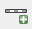{width="0.23825568678915135in"
height="0.215919728783902in"}. Även denna knapp finns i *Verktygslådan.*
Klicka och dra en rektangel i den centrala ytan till önskad storlek.

Både norr-pil och skalstock har tillhörande elementegenskaper som är
åtkomliga via panelen till höger då respektive element selekteras.

### 11.9 Attributtabell {#attributtabell .unnumbered}

En attributtabell läggs till layouten via knappen *Lägger till en ny
Attributtabell...*
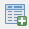{width="0.23280839895013122in"
height="0.23280839895013122in"}. Även den finns i *Verktygslådan* till
vänster och attributtabellen läggs in i layouten genom att klicka och
dra en rektangel. I elementegenskaperna för attributtabellen, välj
*Östergötland* för inställningen *Lager.* Klicka därefter på knappen
*Attribut* och ha kvar attributen *KnNamn* samt de två
ökningsattributen. Passa även på att lägga till en sortering i fallande
ordning på attributet *Ökning\_*50. Skriv även rubriker som kan visas
istället för de kryptiska attributnamnen.

Typsnitt för attributtabellen sätts längre ner i elementegenskaperna
under *Typsnitt och stil på text.* Gör texterna lite större och ge
rubrikraden fet stil. För att uppnå "zebra-effekt" av attributtabellen,
gå till inställningarna i *Utseende Avancerad anpassning.* Jfr Figur
11.4 nedan.

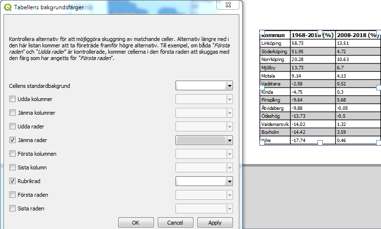{width="3.671272965879265in"
height="2.2075393700787402in"}

*Figur 11.4 Randig "zebra-layout" av attributtabellen.*

### 11.10 Exportera kartan  {#exportera-kartan .unnumbered}

Efter att ha lagt till de olika elementen i föregående avsnitt, ser
layouten ut likt Figur 11.5 nedan.

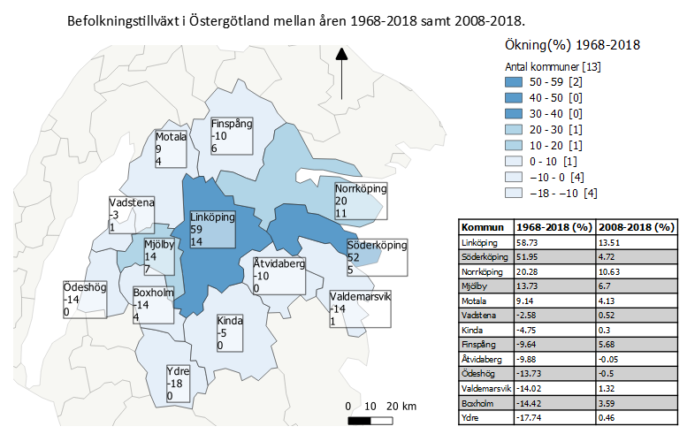{width="6.027037401574803in"
height="3.808753280839895in"}

*Figur 11.5 Ett exempel på färdig layout.*

För att exportera layouten, finns några exportverktyg i verktygsraden
högst upp. Det finns bl.a. en knapp för PDF
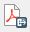{width="0.21503827646544182in"
height="0.2293733595800525in"} och en för bildfil
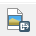{width="0.22170603674540681in"
height="0.22170603674540681in"}. Vad som är lämpligast beror på syftet,
men en bildfil går enkelt att importera vidare i andra dokument. Efter
att ha tryckt på knappen *Exportera som bild*, får vi möjlighet att peka
ut lämplig plats att spara bilden på. Det kommer därefter upp en ny
ruta, *Bildexportalternativ*. Lämna dessa som de är och tryck *Save.* Då
exporten är klar, visas en bekräftelse samt länk till exporterad bild
högst upp, jfr Figur 11.6 nedan.

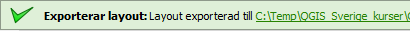{width="4.3in" height="0.3in"}

*Figur 11.6 Bekräftelse, exporterad bild.*

## Insticksprogram

En viktig del i QGIS arkitektur är insticksprogrammen, *eng plugins.*
Dessa är skräddarsydda verktyg, tänkta för specifika användningsområden
eller användargrupper. Strategin att inte lägga in all funktion direkt i
programmet, gör att standardinstallationen av QGIS blir mindre,
smidigare och tänkt att fylla basbehovet för de flesta användare.

Vem som helst kan utveckla ett insticksprogram och göra tillgängligt för
alla användare. Insticksprogrammen är skrivna i Python eller C++.

Administration av insticksprogram görs via menyraden *Plugin Hantera och
installera plugin.* Här går det att få information om befintliga samt
söka efter och installera nya insticksprogram. Nedan syns exempel på
sökning efter insticksprogram (Figur 12.1) samt användning av detsamma
(Figur 12.2). Insticksprogrammet som visas nedan heter
*QuickMapServices* och gör att du t.ex. kan hämta OpenStreetMap som
bakgrundskarta i kartvyn.

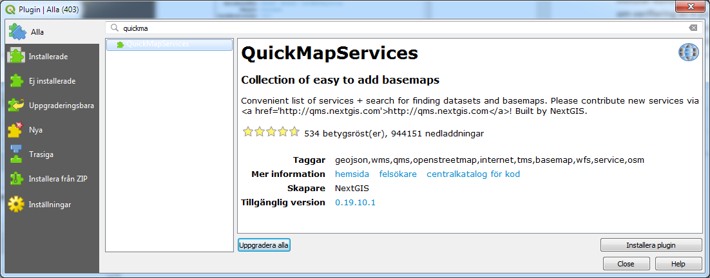{width="4.275673665791776in"
height="1.675958005249344in"}

*Figur 12.1 Administration av insticksprogram*

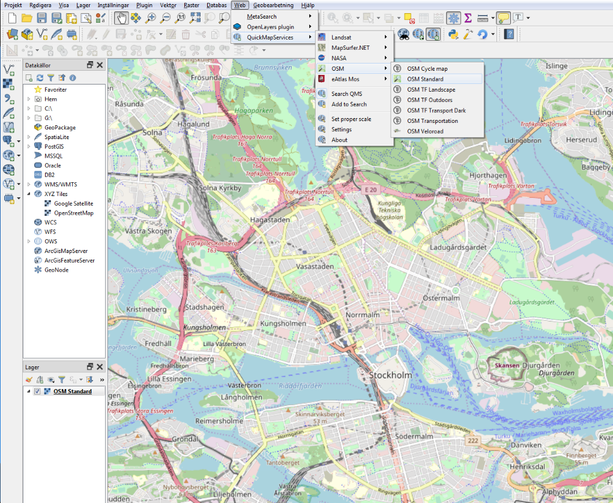{width="4.613207567804024in"
height="3.7904582239720037in"}

*Figur 12.2 OpenStreetMap som bakgrundskarta via insticksprogrammet
QuickMapServices.*

## Appendix A Hämta data ifrån Lastkajen (Trafikverket) {#appendix-a-hämta-data-ifrån-lastkajen-trafikverket .unnumbered}

Materialet är tillgängligt under licensformen CC0, vilket innebär att vi
är fria att använda datat kostnadsfritt och utan att behöva ange
upphovskälla. Dock behöver vi registrera ett konto med e-postadress och
lösenord för att kunna hämta data. Detta görs via att öppna sidan
<https://lastkajen.trafikverket.se/login.aspx> i en webbläsare och
klicka på länken *Registrera dig* (jfr Figur A.1 nedan).

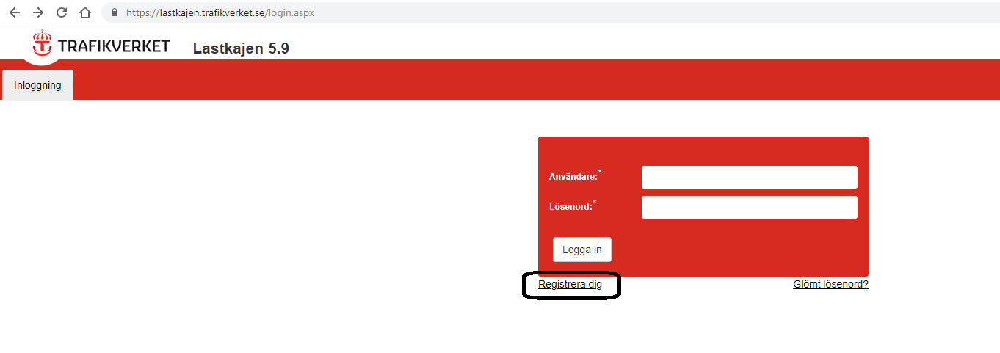{width="6.3in" height="2.225in"}

*Figur A.1 Inloggningssida för Lastkajen.*

Godkänn licensavtalet, ange en epost-adress och klicka på knappen
Registrera dig. Inom några minuter kommer du att få några mail ifrån
Lastkajen till uppgiven epost-adress. Öppna först mailet om verifiering
av e-post och klicka på länken i detta för att verifiera din e-post.
Logga därefter in i Lastkajen med din epost tillsammans med det
temporära lösenord du fått i ett utav mailen. Efter inloggningen, ändra
ditt temporära lösenord till något mera lätthanterligt via *Mina
uppgifter Ändra lösenord*.

För att söka och hämta geodata, gå till fliken fillager och använd
sökrutan eller trädstrukturen till vänster.

## Appendix B Formatet GeoPackage {#appendix-b-formatet-geopackage .unnumbered}

*GeoPackage* är ett öppet, standardbaserat, plattformsoberoende och
kompakt format för geografisk information definierat av OGC (*Open
Geospatial Consortium*). Formatet utvecklades för att det tidigare inte
fanns ett öppet utbytesformat för geodata som stödde både vektor- och
rasterdata. Formatet publicerades 2014 och är en behållare till en
SQLite databasfil med filändelsen *.gpkg*. *GeoPackage Encoding
Standard* styr reglerna och kraven för innehållet i GeoPackage.
Standarden innehåller även schemat för GeoPackage, tabelldefinitioner
samt formatets begränsningar.

Att det är ett öppet format gör det lättare att använda i olika
programvaror och utbyte av data kan ske utan transformation av
filformat. GeoPackage är särskilt användbart för mobila enheter som ska
användas där det är begränsad uppkoppling och bandbredd.

Fördelen med GeoPackage jämfört med t.ex. shape (.shp) är att man kan
samla många underlag i en och samma fil samt att shape-filer har
begränsningar för filstorlek och längd på attributnamn. Mer information
om formatet finns på <https://www.geopackage.org/>.

## Appendix C Om QGIS Sverige {#appendix-c-om-qgis-sverige .unnumbered}

Om du arbetar mycket med QGIS, är det bra att känna till att föreningen
QGIS Sverige finns. Det är en förening som syftar till att främja
användning och utveckling av det fria GIS-programmet QGIS i Sverige.
Detta genom att stödja utbyte av kunskap och erfarenhet mellan
föreningens medlemmar. Föreningen ska även stödja det internationella
QGIS-projektet. Föreningens huvudintresse är QGIS, men bevakar även
andra geodataprogram och -verktyg som bygger på öppen källkod.

Om du är intresserad av att bli medlem eller bara vill veta mer, besök
gärna QGIS Sveriges hemsida. Där kan du också gå med i föreningens
chattkanal där det går att ställa frågor och få input från andra QGIS
användare. Information om föreningen finns via <http://www.qgis.se/>.
